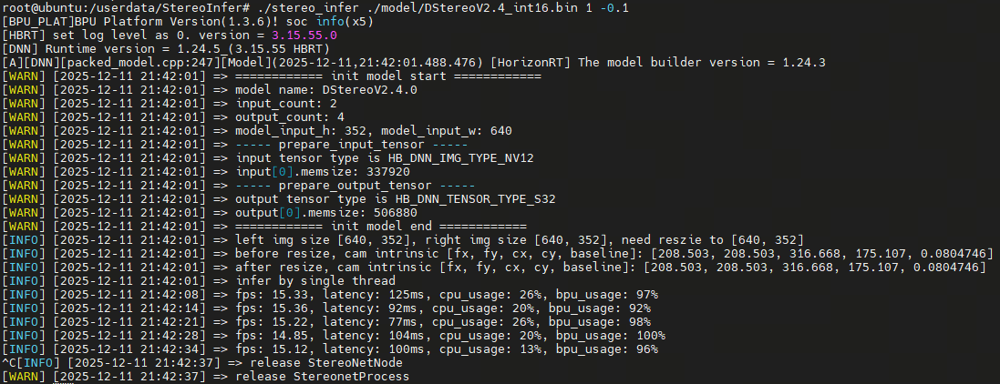
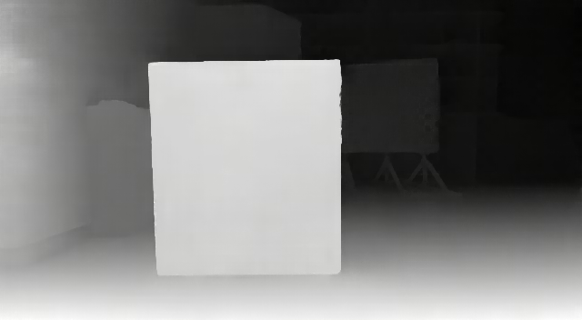
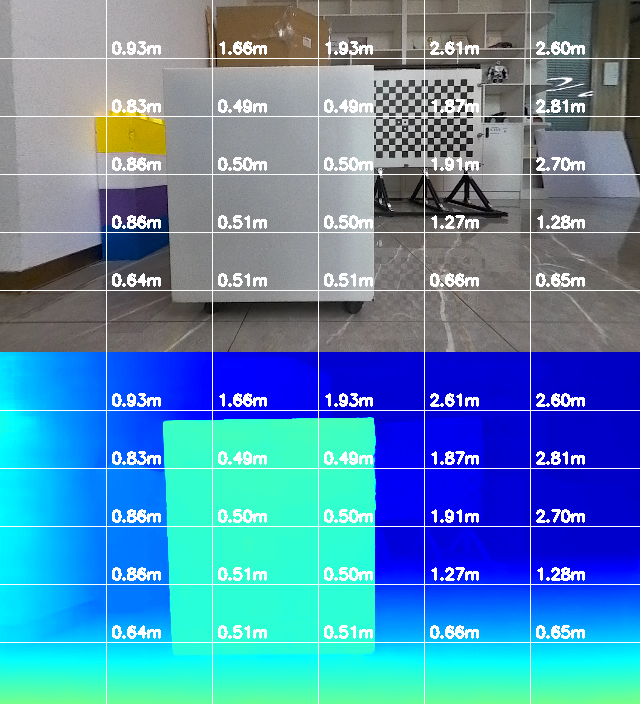
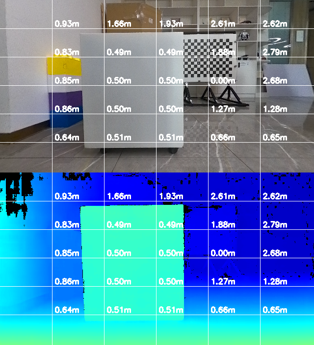
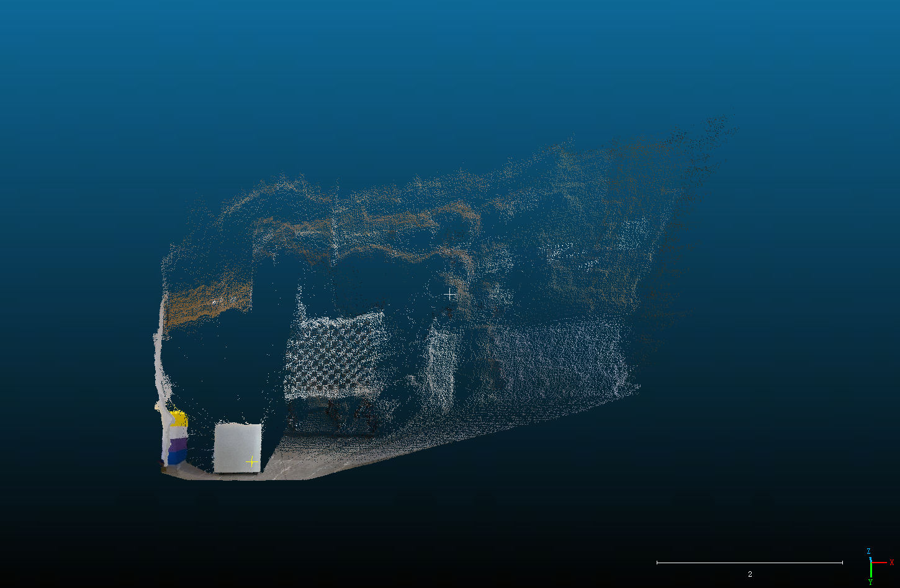

# StereoInfer

Stereo inference code. It takes stereo left-right images and camera intrinsics as input,
and outputs disparity maps, depth maps, visualization images, point clouds, etc.

## Build

-   Dependencies: OpenCV (image processing), Eigen (matrix operations),
    DNN (X5 BPU interface), NEON (ARM instruction acceleration).
    All of these libraries are located in the `3rdparty` directory.

-   Download the compiler

    -   Download link:
        https://developer.arm.com/downloads/-/arm-gnu-toolchain-downloads

    -   This example uses `arm-gnu-toolchain-11.3.rel1-x86_64-aarch64-none-linux-gnu.tar.xz `.
        Please download the corresponding version and extract it.

        ``` bash
        tar -xvf arm-gnu-toolchain-11.3.rel1-x86_64-aarch64-none-linux-gnu.tar.xz -C /opt
        ```

-   Use cross-compilation for building. Make sure the compiler path in `run_build.sh` matches your own installation.

``` cmake
cmake -DCMAKE_BUILD_TYPE=Release .. \
  -DCMAKE_C_COMPILER=/opt/arm-gnu-toolchain-11.3.rel1-x86_64-aarch64-none-linux-gnu/bin/aarch64-none-linux-gnu-gcc \
  -DCMAKE_CXX_COMPILER=/opt/arm-gnu-toolchain-11.3.rel1-x86_64-aarch64-none-linux-gnu/bin/aarch64-none-linux-gnu-g++
```

-   Enter the `DStereo_X5` directory and run the build script:

``` bash
cd DStereo_X5
bash run_build.sh
```

-   After compilation, an algorithm test package `StereoInfer.tar` will
    be generated in the `build` directory.\
    Copy the test package to the `userdata` directory on the X5 board
    and extract it:

``` bash
cd /userdata/
mkdir StereoInfer
tar -xvf StereoInfer.tar -C StereoInfer
```

## Run

-   After extracting the test package, go into the `StereoInfer`
    directory and run the script to create symbolic links:
``` bash
    cd /userdata/StereoInfer
    bash make_ln.sh
```

-   Finally, run the program:

``` bash
export LD_LIBRARY_PATH=${LD_LIBRARY_PATH}:/userdata/StereoInfer/3rdparty/lib_opencv4.5.4/lib/
./stereo_infer ./model/DStereoV2.4_int16_uncertainty.bin 1 0.10
```

Parameter Explanation:
1. The first parameter is the `bin` model, which allows you to specify other models, and the model is in the `model` directory
2. The second parameter is the number of `inference threads`, set to 1 for single-threaded inference, greater than 1 for multi-threaded inference, and the single-threaded inference `latency` is smaller
3. The third parameter is `uncertainty`, which will only take effect if the model supports uncertainty, and it is recommended to set it to `0.10`
4. All 3 parameters are optional, and the default value is `./model/DStereoV2.4_int16.bin` for the first parameter, `1` for the second parameter, and `-0.10` for the third parameter

After execution, you can check the console log output for the program's `fps`, `latency`, `cpu_usage`, `bpu_usage`.
This information is also recorded in `performance_xx.txt` in the current directory.



 | Name      | Description                                                                                                                                                  |
 | --------- | ------------------------------------------------------------------------------------------------------------------------------------------------------------ |
 | fps       | Frame processed per second                                                                                                                                   |
 | latency   | Including process of 'model inference', 'disparity porcess and convert disparity to depth and point cloud', 'uncertainty filter'                             |
 | cpu_usage | One-core CPU usage for the whole program, including model processing and result saving                                                                       |
 | bpu_usage | One-core BPU usage for the whole system. If other models, such as segmentation or detection, are running at the same time, their usage will also be included |


We have two types of models currently: one includes uncertainty information, while the other does not.
Comparing the results below, we can see that the noise can be filtered out using the uncertainty.

The following files will be generated in the `result` directory:

  | Name                       | without uncertainty Result                       | with uncertainty Result                                                                                         | Description                                                                                                                                                            |
  | -------------------------- | ------------------------------------------------ | --------------------------------------------------------------------------------------------------------------- | ---------------------------------------------------------------------------------------------------------------------------------------------------------------------- |
  | depth_{timestamp}.png      |     | None                                                                                                            | Depth map aligned with the left image (unit: mm)                                                                                                                       |
  | disparity_{timestamp}.pfm  |  |                                                                 | Disparity map aligned with the left image (unit:pixels)                                                                                                                |
  | visual_{timestamp}.png     |          |    the black empty hole is the bad or edge area filtered by uncertainty | Top: left image; Bottom: depth pseudo-color image. <br> Color gradient red → yellow → green → blue indicates distance from near to far. Numbers show grid point depths |
  | pointcloud_{timestamp}.pcd |  |                                                                 | 3D point cloud generated from the left image                                                                                                                           |
-   Disparity maps, depth maps, and visualization images: It is
    recommended to use
    [cvkit](https://github.com/roboception/cvkit/releases/tag/v2.6.10)
    to open `.pfm` and `.png` files.
-   Point cloud files: It is recommended to use
    [CloudCompare](https://www.cloudcompare.org/) to open `.pcd` files.
