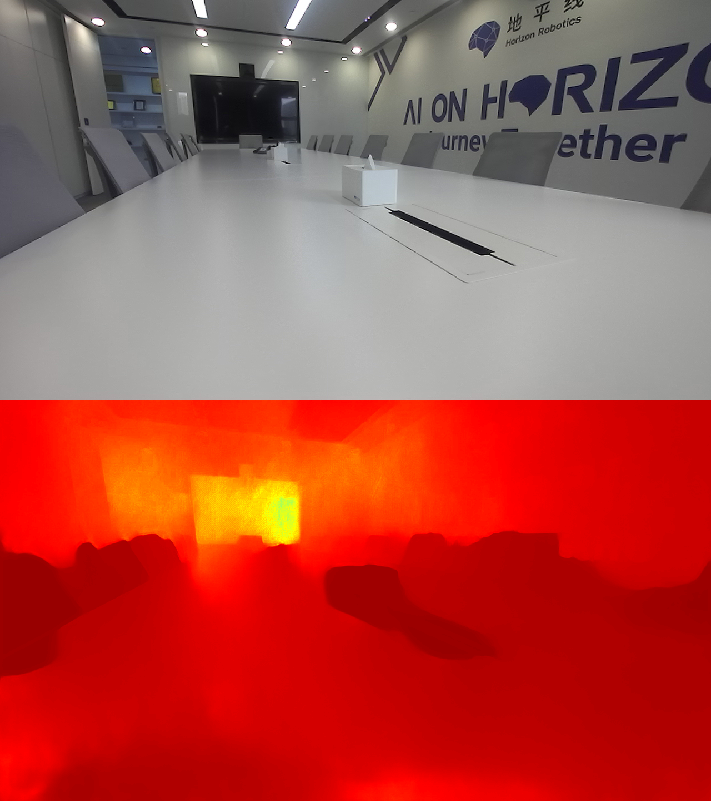
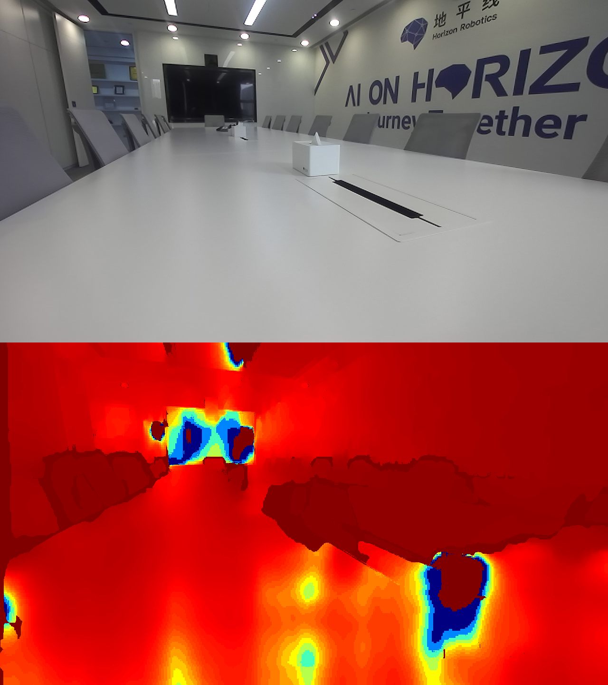

# 功能介绍

双目深度估计算法是使用地平线[OpenExplorer](https://developer.horizon.ai/api/v1/fileData/horizon_j5_open_explorer_cn_doc/hat/source/examples/stereonet.html)在[SceneFlow](https://lmb.informatik.uni-freiburg.de/resources/datasets/SceneFlowDatasets.en.html)数据集上训练出来的`StereoNet`模型。

算法输入为双目图像数据，分别是左右视图。算法输出为左视图的视差。

此示例使用ZED 2i双目相机作为图像数据输入源，利用BPU进行算法推理，发布包含双目图像左图和感知结果的话题消息，在PC端浏览器上渲染显示算法结果。

# 物料清单

ZED 2i双目相机

# 使用方法

## 功能安装

在RDK系统的终端中运行如下指令，即可快速安装：

```bash
sudo apt update
sudo apt install -y tros-hobot-stereonet
sudo apt install -y tros-hobot-stereo-usb-cam
sudo apt install -y tros-hobot-stereonet-render
sudo apt install -y tros-websocket
```

## 启动双目图像发布、算法推理和图像可视化

在RDK系统的终端中运行如下指令启动：

```shell
# 配置tros.b环境
source /opt/tros/setup.bash

# 启动launch文件
ros2 launch hobot_stereonet hobot_stereonet_demo.launch.py 
```

启动成功后，打开同一网络电脑的浏览器，访问RDK的IP地址，即可看到算法可视化的实时效果：



相同场景下ZED的深度估计可视化效果如下：



# 接口说明

## 话题

| 名称         | 消息类型                             | 说明                                     |
| ------------ | ------------------------------------ | ---------------------------------------- |
| /image_jpeg  | sensor_msgs/msg/Image                | 周期发布的图像话题             |

## 参数

| 名称                         | 参数值   | 说明     |
| --------------------------- | ------------------------ | ------------------------------ |
| sub_hbmem_topic_name        | 默认hbmem_stereo_img | 订阅双目图像消息的话题名                        |

# 常见问题
