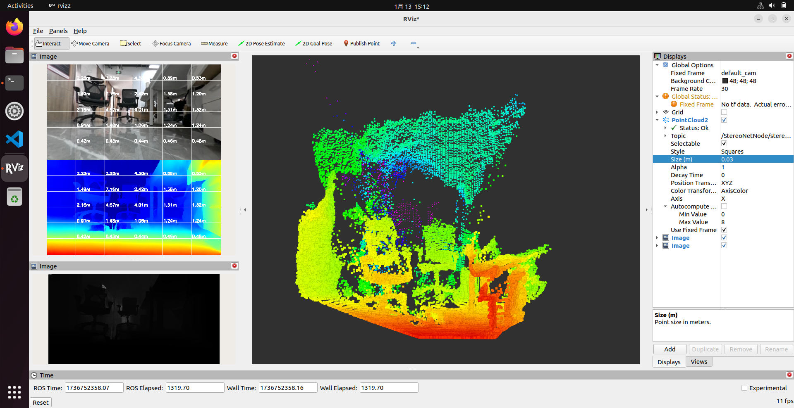
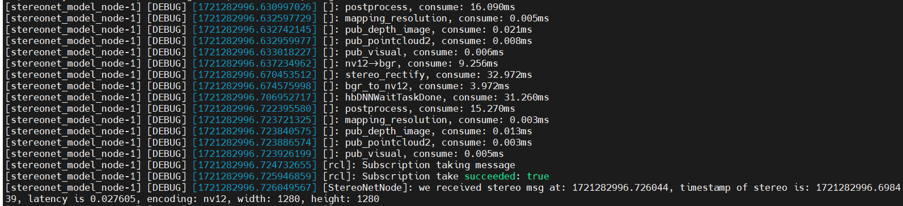

# 功能介绍

双目深度估计算法是使用地平线[OpenExplorer](https://developer.horizon.ai/api/v1/fileData/horizon_j5_open_explorer_cn_doc/hat/source/examples/stereonet.html)在[SceneFlow](https://lmb.informatik.uni-freiburg.de/resources/datasets/SceneFlowDatasets.en.html)数据集上训练出来的`StereoNet`模型。

算法输入为双目图像数据，分别是左右视图。算法输出为左视图的视差。

此示例使用mipi双目相机作为图像数据输入源，利用BPU进行算法推理，发布包含双目图像左图和感知结果的话题消息，在PC端rviz2上渲染算法结果。

# 物料清单

双目相机

# 支持平台

| 平台   | 运行方式              | 示例功能                                      |
| ------ | --------------------- | --------------------------------------------- |
| RDK X5 | Ubuntu 22.04 (Humble) | · 启动双目相机、推理出深度结果，并在Web端显示 |


# 使用方法

## 功能安装

在RDK系统的终端中运行如下指令，即可快速安装：

tros humble 版本
```bash
sudo apt update
sudo apt-get remove tros-humble-stereonet-model
# 如果卸载失败，则执行：
# sudo dpkg --remove --force-all tros-humble-stereonet-model

sudo apt install -y tros-humble-hobot-stereonet
```

## 启动双目图像发布、算法推理和图像可视化

在RDK系统的终端中运行如下指令启动：

tros humble 版本
```shell
# 配置tros.b humble环境
source /opt/tros/humble/setup.bash

# 启动双目模型launch文件，其包含了算法和双目相机节点的启动
ros2 launch hobot_stereonet stereonet_model_web_visual.launch.py \
stereo_image_topic:=/image_combine_raw stereo_combine_mode:=1 need_rectify:="True" \
height_min:=0.1 height_max:=1.0 KMean:=10 stdv:=0.01 leaf_size:=0.05

```

另外可以通过 component 的方式启动节点
```shell 
# 配置tros.b humble环境
source /opt/tros/humble/setup.bash

# 终端1 启动双目模型launch文件
ros2 launch hobot_stereonet stereonet_model_component.launch.py \
stereo_image_topic:=/image_combine_raw stereo_combine_mode:=1 need_rectify:="True" \
height_min:=0.1 height_max:=1.0 KMean:=10 stdv:=0.01 leaf_size:=0.05

# 终端2 启动mipi双目相机launch文件
ros2 launch mipi_cam mipi_cam_dual_channel.launch.py \
mipi_image_width:=1280 mipi_image_height:=640
```

如果想利用本地图片评估算法效果，可以使用下列命令指定算法运行模式、图像数据地址以及相机内参，同时要保证图像数据经过去畸变、基线对齐。

```shell
# 配置tros.b humble环境
source /opt/tros/humble/setup.bash

# 进入算法数据目录
cd /opt/tros/humble/share/hobot_stereonet/

# 启动双目模型launch文件
ros2 launch hobot_stereonet stereonet_model_web_visual.launch.py \
need_rectify:="False" use_local_image:="True" local_image_path:=`pwd`/data/ \
camera_fx:=505.044342 camera_fy:=505.044342 camera_cx:=605.167053 camera_cy:=378.247009 base_line:=0.069046
```

参数含义如下：

| 名称             | 参数值     | 说明                 |
| ---------------- | ---------- | -------------------- |
| use_local_image  | 默认 False | 是否启用图片回灌模式 |
| local_image_path | -          | 回灌图像的地址目录   |
| camera_fx        | -          | 相机内参             |
| camera_fy        | -          | 相机内参             |
| camera_cx        | -          | 相机内参             |
| camera_cy        | -          | 相机内参             |
| base_line        | -          | 基线距离             |

图片的格式如下图所示，第一张左目图像的命名为left000000.png，第二张左目图像的命名为left000001.png，以此类推。
对应的第一张右目图像的命名为right000000.png，第二张右目图像的命名为right000001.png，以此类推。
算法按序号遍历图像，直至图像全部计算完毕。


启动成功后，打开同一网络电脑的rviz2，订阅双目模型节点发布的相关话题，即可看到算法可视化的实时效果：


 也可以在PC上可通过浏览器观察到算法的运行结果，地址为X5的8000端口，比如X5的ip地址为10.112.148.155，
 那么在浏览器输入 10.112.148.155:8000 即可：


# 接口说明

## 订阅话题

| 名称               | 消息类型                | 说明                                                   |
| ------------------ | ----------------------- | ------------------------------------------------------ |
| /image_combine_raw | sensor_msgs::msg::Image | 双目相机节点发布的左右目拼接图像话题，用于模型推理深度 |


## 发布话题

| 名称                                 | 消息类型                      | 说明                                     |
| ------------------------------------ | ----------------------------- | ---------------------------------------- |
| /StereoNetNode/stereonet_pointcloud2 | sensor_msgs::msg::PointCloud2 | 发布的点云深度话题                       |
| /StereoNetNode/stereonet_depth       | sensor_msgs::msg::Image       | 发布的深度图像，像素值为深度，单位为毫米 |
| /StereoNetNode/stereonet_visual      | sensor_msgs::msg::Image       | 发布的比较直观的可视化渲染图像           |

## 参数

| 名称                | 参数值                  | 说明                                                                                       |
| ------------------- | ----------------------- | ------------------------------------------------------------------------------------------ |
| stereo_image_topic  | 默认 /image_combine_raw | 订阅双目图像消息的话题名                                                                   |
| need_rectify        | 默认 True               | 是否对双目数据做基线对齐和去畸变，相机内外参在config/stereo.yaml文件内指定                 |
| stereo_combine_mode | 默认 1                  | 左右目图像往往拼接在一张图上再发布出去，1为上下拼接，0为左右拼接，指示双目算法如何拆分图像 |
| height_min          | 默认 -0.2               | 过滤掉相机垂直方向上高度小于height_min的点，单位为米                                       |
| height_max          | 默认 999.9              | 过滤掉相机垂直方向上高度大于height_max的点，单位为米                                       |
| KMean               | 默认 10                 | 过滤稀疏离群点时每个点的临近点的数目，统计每个点与周围最近10个点的距离                     |
| stdv                | 默认 0.01               | 过滤稀疏离群点时判断是否为离群点的阈值，将标准差的倍数设置为0.01                           |
| leaf_size           | 默认 0.05               | 设置点云的单位密度，表示半径0.05米的三维球内只有一个点                                     |

# 算法耗时

当log等级设置为debug时，程序会打印出算法各阶段耗时情况，供用户debug算法性能瓶颈。
```shell
ros2 launch hobot_stereonet stereonet_model.launch.py \
stereo_image_topic:=/image_combine_raw stereo_combine_mode:=1 need_rectify:="True" log_level:=debug
```


# 注意事项
1. 模型的输入尺寸为宽：1280，高640，相机发布的图像分辨率应为1280x640
2. 如果双目相机发布图像的格式为NV12，那么双目图像的拼接方式必须为上下拼接


# 离线工具

## 检查基线对齐精度

基线不对齐会极大影响算法精度。
源码目录下的tools文件夹内提供了基线对齐检测工具，可以在PC上检查相机图像的基线对齐精度。
工具使用特征提取和匹配算法检查基线是否完全对齐，理想情况下，特征点的y坐标应该完全一致。
选取10个最佳的匹配点，检查匹配点的y坐标。
PC上需要预装ROS2以及OpenCV (version: 4)
```shell
# 在PC上进入tools目录，创建build目录并编译
cd tools
mkdir build
cd build 
cmake .. 
make -j2
# 运行工具，image_path是需要检查的图像的地址
./stereonet_matcher --ros-args -p image_path:=`pwd`/../images/
```
工具运行后会显示出对齐的结果，选取10个特征点对比其在左右目的y坐标，如下图。

绿色表示y坐标对齐，红色表示没有对齐。匹配的结果同时会保存在本地的"result.jpg"。
工具敲入“回车”键读取下一张图，敲入“q”键退出工具。
控制台打印的log是具体的匹配结果。

## 深度图/视差图离线渲染工具

### 代码文件路径

```
hobot_stereonet/script/render.py
```

### 运行

1. 安装python依赖包

```shell
pip install -r requirements.txt
```

2. 文件组织格式


程序会读取`depth`、`disp`、`left`开头的文件，对应`深度图`、`视差图`、`左图`，其中`深度图`支持`png`格式的`16bit`
图像，`视差图`支持`pfm/tiff`格式的`float32`图像，请固定文件的开头，并保证`深度图`、`视差图`、`左图`的后缀是一致的。

3. 批量渲染

```shell
# 通过img_dir指定文件夹路径，img_type指定渲染深度图还是视差图，save_dir指定保存路径
python render.py --img_dir=./depth_img_dir --img_type=depth --save_dir=./render_depth
```

4. 单张图渲染

```shell
# 通过img_path指定但张图路径，img_type指定渲染深度图还是视差图，save_dir指定保存路径
python render.py --img_path=./depth000001.png --img_type=depth --save_dir=./render_depth
```

5. 参数说明

| 名称                | 默认值                              | 类型   | 说明                                                                              |
| ------------------- | ----------------------------------- | ------ | --------------------------------------------------------------------------------- |
| img_dir             | ''                                  | string | 文件夹目录，按渲染需求包含需要的左图、深度图、视差图                              |
| img_path            | ''                                  | string | 渲染图像的路径，指定单张深度图/视差图的路径                                       |
| img_type            | depth                               | string | 渲染图像的类型，可设置为[depth, disp]，一定要指定渲染的是深度图还是视差图         |
| min_disp            | 2.0                                 | float  | 视差小于该值，不进行渲染，颜色为黑色                                              |
| max_disp            | 192.0                               | float  | 视差大于该值，不进行渲染，颜色为黑色                                              |
| min_depth           | 0.0                                 | float  | 深度小于该值，不进行渲染，颜色为黑色                                              |
| max_depth           | 10000.0 (默认单位是mm，这里表示10m) | float  | 深度大于该值，不进行渲染，颜色为黑色                                              |
| save_dir            | ''                                  | string | 保存结果的目录，会自动创建                                                        |
| save_gif            | False                               | bool   | 是否保存gif图像，设置会True会在结果目录保存gif动图                                |
| need_left_img       | False                               | bool   | 是否在保存结果时附带左图，需要对应的文件夹下有左图，左图会拼接在深度图/视差图上方 |
| need_speckle_filter | True                                | bool   | 是否需要speckle filter，会去除深度图/视差图的散点                                 |

### 结果展示

| 深度渲染结果                                  | 视差渲染结果                                |
| --------------------------------------------- | ------------------------------------------- |
|  |  |

