# hobot_stereonet

[简体中文](./README_CN.md) | English

## Introduction

hobot_stereonet is a self-developed deep learning-based stereo depth algorithm by DigRobot. It takes color stereo images as input and outputs a depth map for the left view, which can be further converted into a point cloud using camera intrinsics. The algorithm balances accuracy and efficiency, making it highly valuable for practical applications.

The algorithm can be paired with multiple MIPI and USB stereo cameras, such as the 230ai, 132gs, and ZED stereo cameras.

## Preparation

- RDK X5
- Stereo camera

## Supported Platforms

| Platform | Execution Method      | Example Functionality                                           |
| -------- | --------------------- | --------------------------------------------------------------- |
| RDK X5   | Ubuntu 22.04 (Humble) | Start stereo camera, infer depth results, and display on Web UI |

## Building hobot_stereonet

### Installation from TROS.b

Users of RDK X5 can install and experience the functionality of hobot_stereonet following the guide here: [Stereo Depth Algorithm](https://developer.d-robotics.cc/rdk_doc/Robot_development/boxs/function/hobot_stereonet)

### Building from Source

- It is recommended to use a cross-compilation environment for compiling the source code. Refer to the guide for setting up the cross-compilation environment: [5.1.3 Source Installation](https://developer.d-robotics.cc/rdk_doc/Robot_development/quick_start/cross_compile)

- After setting up the environment, execute the following commands to compile the source code:

```bash
git clone https://github.com/D-Robotics/hobot_stereonet.git
bash ./robot_dev_config/build.sh -p X5 -s hobot_stereonet
```

## Stereo Model Versions

Currently, the stereo algorithm has the following versions available:

| Algorithm Version | Algorithm Features                                                               | Corresponding Model            |
| ----------------- | -------------------------------------------------------------------------------- | ------------------------------ |
| V2.0              | High accuracy, low frame rate, outputs 15FPS depth map at 640*352 resolution     | x5baseplus_alldata_woIsaac.bin |
| V2.1              | Includes confidence for disparity filtering                                      | DStereoV2.1.bin                |
| V2.2              | Lower accuracy, higher frame rate, outputs 23FPS depth map at 640*352 resolution | DStereoV2.2.bin                |
| V2.3              | Further improved frame rate, outputs 27FPS depth map at 640*352 resolution       | V22_disp96.bin                 |

## Running the Launch Files

#### (1) Starting with the Official RDK X5 MIPI Stereo Camera

- The official RDK X5 MIPI stereo camera is shown below:

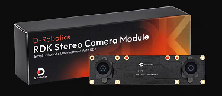

- Installation method is shown below. Ensure correct wiring; incorrect wiring may result in left-right image swapping and incorrect stereo algorithm operation:

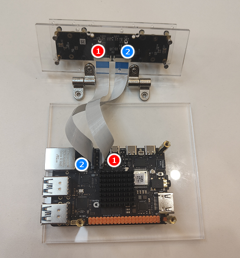

- Verify camera connection via SSH to RDK X5 by executing the following commands. If the output matches the image below, the camera is connected correctly:

```bash
i2cdetect -r -y 4
i2cdetect -r -y 6
```

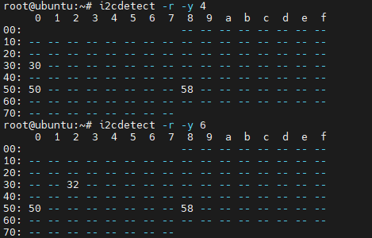

- Start the corresponding version of the stereo algorithm using different launch files via SSH to RDK X5:

- V2.0

```bash
# Configure tros.b humble environment
source /opt/tros/humble/setup.bash

# Start the stereo model launch file, which includes algorithm and stereo camera node startup
ros2 launch hobot_stereonet stereonet_model_web_visual_v2.0.launch.py \
mipi_image_width:=640 mipi_image_height:=352 mipi_lpwm_enable:=True mipi_image_framerate:=15.0 \
need_rectify:=False height_min:=-10.0 height_max:=10.0 pc_max_depth:=5.0
```

- V2.1

```bash
# Configure tros.b humble environment
source /opt/tros/humble/setup.bash

# Start the stereo model launch file, which includes algorithm and stereo camera node startup
ros2 launch hobot_stereonet stereonet_model_web_visual_v2.1.launch.py \
mipi_image_width:=640 mipi_image_height:=352 mipi_lpwm_enable:=True mipi_image_framerate:=25.0 \
need_rectify:=False height_min:=-10.0 height_max:=10.0 pc_max_depth:=5.0 uncertainty_th:=0.09
```

- V2.2

```bash
# Configure tros.b humble environment
source /opt/tros/humble/setup.bash

# Start the stereo model launch file, which includes algorithm and stereo camera node startup
ros2 launch hobot_stereonet stereonet_model_web_visual_v2.2.launch.py \
mipi_image_width:=640 mipi_image_height:=352 mipi_lpwm_enable:=True mipi_image_framerate:=25.0 \
need_rectify:=False height_min:=-10.0 height_max:=10.0 pc_max_depth:=5.0
```

- V2.3

```bash
# Configure tros.b humble environment
source /opt/tros/humble/setup.bash

# Start the stereo model launch file, which includes algorithm and stereo camera node startup
ros2 launch hobot_stereonet stereonet_model_web_visual_v2.3.launch.py \
mipi_image_width:=640 mipi_image_height:=352 mipi_lpwm_enable:=True mipi_image_framerate:=30.0 \
need_rectify:=False height_min:=-10.0 height_max:=10.0 pc_max_depth:=5.0
```

Parameter explanations:

| Parameter Name       | Parameter Value | Description                                                                               |
| -------------------- | --------------- | ----------------------------------------------------------------------------------------- |
| mipi_image_width     | 640             | Output resolution of MIPI camera is 640*352                                               |
| mipi_image_height    | 352             | Output resolution of MIPI camera is 640*352                                               |
| mipi_lpwm_enable     | True            | Enable hardware synchronization for MIPI camera                                           |
| mipi_image_framerate | 30.0            | Output frame rate of MIPI camera is 30.0FPS                                               |
| need_rectify         | False           | Official cameras come with pre-calibrated parameters; no need for custom calibration file |
| height_min           | -10.0           | Minimum height for point cloud is -10.0m                                                  |
| height_max           | 10.0            | Maximum height for point cloud is 10.0m                                                   |
| pc_max_depth         | 5.0             | Maximum distance for point cloud is 5.0m                                                  |
| uncertainty_th       | 0.09            | Confidence threshold, only applicable for V2.1 model                                      |

- If the following log appears, the stereo algorithm has started successfully. `fx/fy/cx/cy/base_line` are the camera intrinsics. If the depth map is normal but the estimated distance is off, there may be an issue with the camera intrinsics:

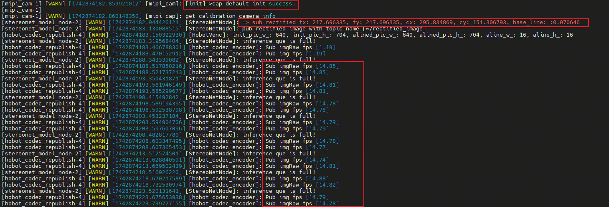

- View the depth map via the web interface by entering http://ip:8000 in a browser (the RDK X5 IP in the image is 192.168.1.100):

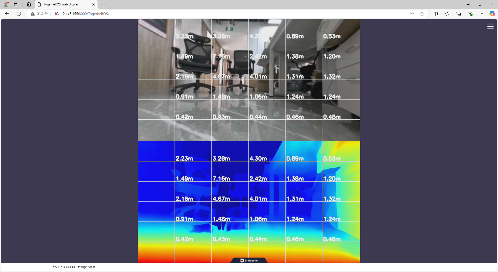

- View the point cloud via rviz2. Ensure the user has basic ROS2 knowledge, configure the PC and RDK X5 to be in the same network segment, ping each other, and subscribe to the relevant topics published by the stereo model node to display the point cloud in rviz2. Note the following configuration in rviz2:

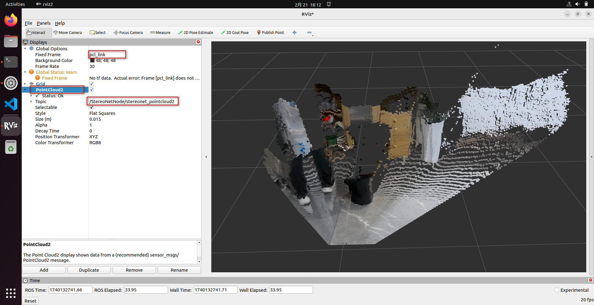

- If the user wants to save the depth estimation results, the following parameters can be added. `save_image_all` enables saving, `save_freq` controls the saving frequency, `save_dir` controls the saving directory (created automatically if it does not exist), and `save_total` controls the total number of saves. The program will save **camera intrinsics, left and right images, disparity map, depth map, and visualization image**:

```bash
# Configure tros.b humble environment
source /opt/tros/humble/setup.bash

# Example for V2.0 version; similar parameters can be added for other versions
ros2 launch hobot_stereonet stereonet_model_web_visual_v2.0.launch.py \
mipi_image_width:=640 mipi_image_height:=352 mipi_lpwm_enable:=True mipi_image_framerate:=15.0 \
need_rectify:=False height_min:=-10.0 height_max:=10.0 pc_max_depth:=5.0 \
save_image_all:=True save_freq:=4 save_dir:=./online_result save_total:=10
```

Parameter explanations:

| Parameter Name | Parameter Value             | Description                                                  |
| -------------- | --------------------------- | ------------------------------------------------------------ |
| save_image_all | True                        | Enable image saving                                          |
| save_freq      | 4                           | Save every 4 frames; can be modified to any positive integer |
| save_dir       | Directory for saving images | Can be set as needed                                         |
| save_total     | 10                          | Save a total of 10 images; set to -1 for continuous saving   |

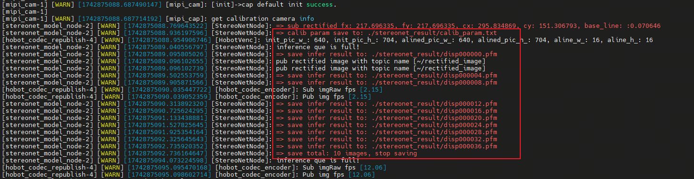

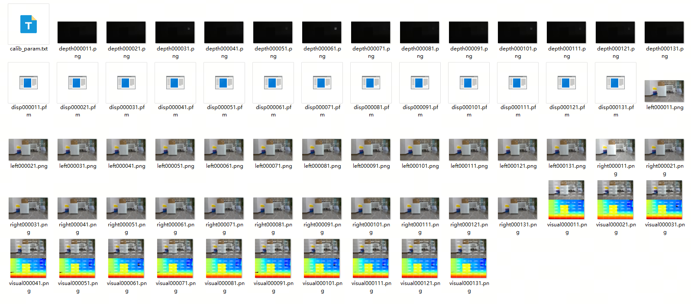

#### (2) Offline Replay with Local Images

- To evaluate the algorithm using local images, use the following command to specify the algorithm's operation mode, image data path, and camera intrinsics. Ensure the image data is undistorted and epipolar-aligned. The image format is shown below. The first left image is named `left000000.png`, the second `left000001.png`, and so on. Correspondingly, the first right image is named `right000000.png`, the second `right000001.png`, and so on. The algorithm processes images sequentially until all are computed:

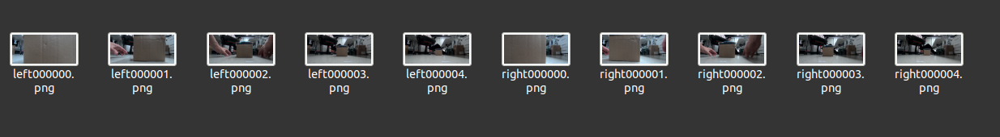

- Run the algorithm offline as follows via SSH to RDK X5:

- V2.0

```shell
# Configure tros.b humble environment
source /opt/tros/humble/setup.bash

# Start the stereo model launch file; note the camera parameter settings, which need to be manually input after calibration
ros2 launch hobot_stereonet stereonet_model_web_visual.launch.py \
stereonet_model_file_path:=/opt/tros/humble/share/hobot_stereonet/config/x5baseplus_alldata_woIsaac.bin postprocess:=v2 \
use_local_image:=True local_image_path:=./online_result \
need_rectify:=False camera_fx:=216.696533 camera_fy:=216.696533 camera_cx:=335.313477 camera_cy:=182.961578 base_line:=0.070943 \
height_min:=-10.0 height_max:=10.0 pc_max_depth:=5.0 \
save_image_all:=True save_dir:=./offline_result image_sleep:=500
```

- V2.1

```shell
# Configure tros.b humble environment
source /opt/tros/humble/setup.bash

# Start the stereo model launch file; note the camera parameter settings, which need to be manually input after calibration
ros2 launch hobot_stereonet stereonet_model_web_visual.launch.py \
stereonet_model_file_path:=/opt/tros/humble/share/hobot_stereonet/config/DStereoV2.1.bin postprocess:=v2.1 \
use_local_image:=True local_image_path:=./online_result \
need_rectify:=False camera_fx:=216.696533 camera_fy:=216.696533 camera_cx:=335.313477 camera_cy:=182.961578 base_line:=0.070943 \
height_min:=-10.0 height_max:=10.0 pc_max_depth:=5.0 uncertainty_th:=0.09 \
save_image_all:=True save_dir:=./offline_result image_sleep:=500
```

- V2.2

```shell
# Configure tros.b humble environment
source /opt/tros/humble/setup.bash

# Start the stereo model launch file; note the camera parameter settings, which need to be manually input after calibration
ros2 launch hobot_stereonet stereonet_model_web_visual.launch.py \
stereonet_model_file_path:=/opt/tros/humble/share/hobot_stereonet/config/DStereoV2.2.bin postprocess:=v2.2 \
use_local_image:=True local_image_path:=./online_result \
need_rectify:=False camera_fx:=216.696533 camera_fy:=216.696533 camera_cx:=335.313477 camera_cy:=182.961578 base_line:=0.070943 \
height_min:=-10.0 height_max:=10.0 pc_max_depth:=5.0 \
save_image_all:=True save_dir:=./offline_result image_sleep:=500
```

- V2.3

```shell
# Configure tros.b humble environment
source /opt/tros/humble/setup.bash

# Start the stereo model launch file; note the camera parameter settings, which need to be manually input after calibration
ros2 launch hobot_stereonet stereonet_model_web_visual.launch.py \
stereonet_model_file_path:=/opt/tros/humble/share/hobot_stereonet/config/V22_disp96.bin postprocess:=v2.3 \
use_local_image:=True local_image_path:=./online_result \
need_rectify:=False camera_fx:=216.696533 camera_fy:=216.696533 camera_cx:=335.313477 camera_cy:=182.961578 base_line:=0.070943 \
height_min:=-10.0 height_max:=10.0 pc_max_depth:=5.0 \
save_image_all:=True save_dir:=./offline_result image_sleep:=500
```

**Note: The replay images must be epipolar-aligned, and correct camera parameters must be set; otherwise, the replay results may be incorrect.**

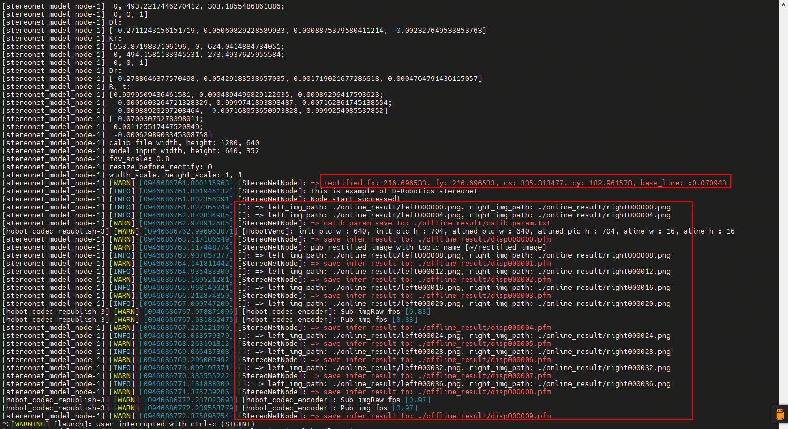

Parameter explanations:

| Parameter Name            | Parameter Value                                                | Description                                                                                                       |
| ------------------------- | -------------------------------------------------------------- | ----------------------------------------------------------------------------------------------------------------- |
| stereonet_model_file_path | Model file path for different stereo algorithm versions        | Set according to the model version                                                                                |
| postprocess               | Post-processing method for different stereo algorithm versions | Set according to the model version                                                                                |
| use_local_image           | True                                                           | Switch for image replay mode                                                                                      |
| local_image_path          | Directory for offline data                                     | Path to the replay images                                                                                         |
| need_rectify              | False                                                          | Replay images should be epipolar-aligned; no need to enable this switch, but manually input calibrated parameters |
| camera_fx                 | Calibrated camera intrinsics fx                                | Camera intrinsics                                                                                                 |
| camera_fy                 | Calibrated camera intrinsics fy                                | Camera intrinsics                                                                                                 |
| camera_cx                 | Calibrated camera intrinsics cx                                | Camera intrinsics                                                                                                 |
| camera_cy                 | Calibrated camera intrinsics cy                                | Camera intrinsics                                                                                                 |
| base_line                 | Calibrated camera baseline                                     | Baseline distance in meters                                                                                       |
| height_min                | -10.0                                                          | Minimum height for point cloud is -10.0m                                                                          |
| height_max                | 10.0                                                           | Maximum height for point cloud is 10.0m                                                                           |
| pc_max_depth              | 5.0                                                            | Maximum distance for point cloud is 5.0m                                                                          |
| save_image_all            | True                                                           | Save replay results                                                                                               |
| save_dir                  | Directory for saving images                                    | Can be set as needed                                                                                              |
| uncertainty_th            | 0.09                                                           | Confidence threshold, only applicable for V2.1 model                                                              |

- After successful algorithm execution, real-time rendering data can also be viewed via the web interface and rviz2. Refer to the above instructions. Offline operation results will be saved in the `result` subdirectory under the offline data directory, including **camera intrinsics, left and right images, disparity map, depth map, and visualization image**.

#### (3) Starting with ZED Stereo Camera

- The ZED stereo camera is shown below:

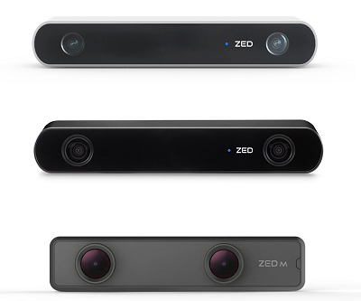

- Connect the ZED camera to RDK X5 via USB, then start the stereo algorithm via SSH to RDK X5:

- **Note: RDK X5 must be connected to the internet when running the ZED camera because ZED needs to download calibration files online. You can ping any website to confirm the board is connected to the internet.**

```shell
ping www.baidu.com
```

- V2.0

```shell
ros2 launch hobot_zed_cam test_stereo_zed_rectify.launch.py \
resolution:=720p dst_width:=640 dst_height:=352 \
stereonet_model_file_path:=/opt/tros/humble/share/hobot_stereonet/config/x5baseplus_alldata_woIsaac.bin postprocess:=v2 \
height_min:=-10.0 height_max:=10.0 pc_max_depth:=5.0
```

- V2.1

```shell
ros2 launch hobot_zed_cam test_stereo_zed_rectify.launch.py \
resolution:=720p dst_width:=640 dst_height:=352 \
stereonet_model_file_path:=/opt/tros/humble/share/hobot_stereonet/config/DStereoV2.1.bin postprocess:=v2.1 \
height_min:=-10.0 height_max:=10.0 pc_max_depth:=5.0 uncertainty_th:=0.09
```

- V2.2

```shell
ros2 launch hobot_zed_cam test_stereo_zed_rectify.launch.py \
resolution:=720p dst_width:=640 dst_height:=352 \
stereonet_model_file_path:=/opt/tros/humble/share/hobot_stereonet/config/DStereoV2.2.bin postprocess:=v2.2 \
height_min:=-10.0 height_max:=10.0 pc_max_depth:=5.0
```

- V2.3

```shell
ros2 launch hobot_zed_cam test_stereo_zed_rectify.launch.py \
resolution:=720p dst_width:=640 dst_height:=352 \
stereonet_model_file_path:=/opt/tros/humble/share/hobot_stereonet/config/V22_disp96.bin postprocess:=v2.3 \
height_min:=-10.0 height_max:=10.0 pc_max_depth:=5.0
```

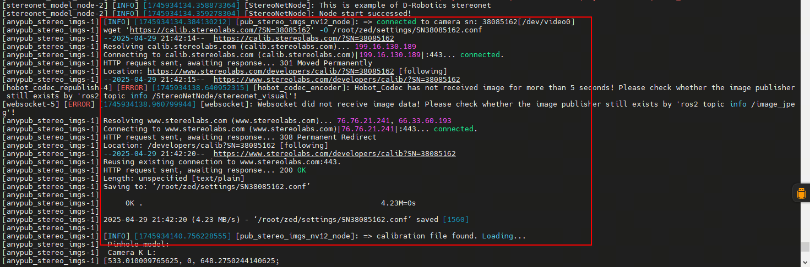

If connected to the internet, the program will automatically download the calibration files. If RDK X5 is not connected to the internet, manually download the calibration files and upload them to the `/root/zed/settings/` directory on RDK X5.

- View the depth map via the web interface by entering http://ip:8000 in a browser. For more information on **point cloud visualization** and **image saving**, refer to the above instructions to set the corresponding parameters.

## hobot_stereonet Package Description

### Subscribed Topics

| Topic Name         | Message Type                 | Description                                                                                                        |
| ------------------ | ---------------------------- | ------------------------------------------------------------------------------------------------------------------ |
| /image_combine_raw | sensor_msgs::msg::Image      | Topic for the left and right image combination published by the stereo camera node, used for model depth inference |
| /camera_info_topic | sensor_msgs::msg::CameraInfo | Topic for the left and right image combination published by the stereo camera node, used for model depth inference |

### Published Topics

| Topic Name                           | Message Type                  | Description                                                               |
| ------------------------------------ | ----------------------------- | ------------------------------------------------------------------------- |
| /StereoNetNode/stereonet_depth       | sensor_msgs::msg::Image       | Published depth image with pixel values representing depth in millimeters |
| /StereoNetNode/stereonet_visual      | sensor_msgs::msg::Image       | Published intuitive visualization rendering image                         |
| /StereoNetNode/stereonet_pointcloud2 | sensor_msgs::msg::PointCloud2 | Published point cloud depth topic                                         |

### Other Important Parameters

| Parameter Name         | Parameter Value                        | Description                                                                                                                                                                               |
| ---------------------- | -------------------------------------- | ----------------------------------------------------------------------------------------------------------------------------------------------------------------------------------------- |
| stereo_image_topic     | /image_combine_raw (default)           | Topic name for subscribing to stereo image messages                                                                                                                                       |
| camera_info_topic      | /image_right_raw/camera_info (default) | Topic name for subscribing to camera calibration parameter messages                                                                                                                       |
| need_rectify           | True (default)                         | Switch for specifying custom calibration file to rectify images                                                                                                                           |
| stereo_calib_file_path | stereo.yaml (default)                  | Path to the calibration file loaded for calibration when `need_rectify=True`                                                                                                              |
| stereo_combine_mode    | 1 (default)                            | Left and right images are often combined into one image before publishing. 1 for vertical combination, 0 for horizontal combination, indicating how the stereo algorithm splits the image |
| KMean                  | 10 (default)                           | Number of neighboring points for filtering sparse outliers; the distance between each point and its 10 nearest neighbors is calculated                                                    |
| stdv                   | 0.01 (default)                         | Threshold for determining outliers when filtering sparse outliers; the standard deviation multiplier is set to 0.01                                                                       |
| leaf_size              | 0.05 (default)                         | Sets the unit density of the point cloud, indicating only one point within a 3D sphere of radius 0.05 meters                                                                              |

### Notes

1. The model input size is 640 wide and 352 high; the camera's published image resolution should be 640x352.
2. If the stereo camera publishes images in NV12 format, the combination method of the stereo images must be vertical.

## Offline Tools

### Checking Epipolar Alignment Accuracy

Misaligned epipolar lines can significantly affect algorithm accuracy. The `tools` folder in the source code directory provides an epipolar alignment detection tool that can check the epipolar alignment accuracy of camera images on a PC. The tool uses feature extraction and matching algorithms to check if the epipolar lines are perfectly aligned. Ideally, the y-coordinates of the feature points should be identical. Select 10 of the best matching points and check their y-coordinates.

Install ROS2 and OpenCV (version: 4) on the PC.

```shell
# Enter the tools directory on the PC, create a build directory, and compile
cd tools
mkdir build
cd build
cmake ..
make -j2
# Run the tool; image_path is the address of the images to be checked
./stereonet_matcher --ros-args -p image_path:=`pwd`/../images/
```

After running the tool, the alignment results will be displayed. Select 10 feature points and compare their y-coordinates in the left and right images, as shown below.

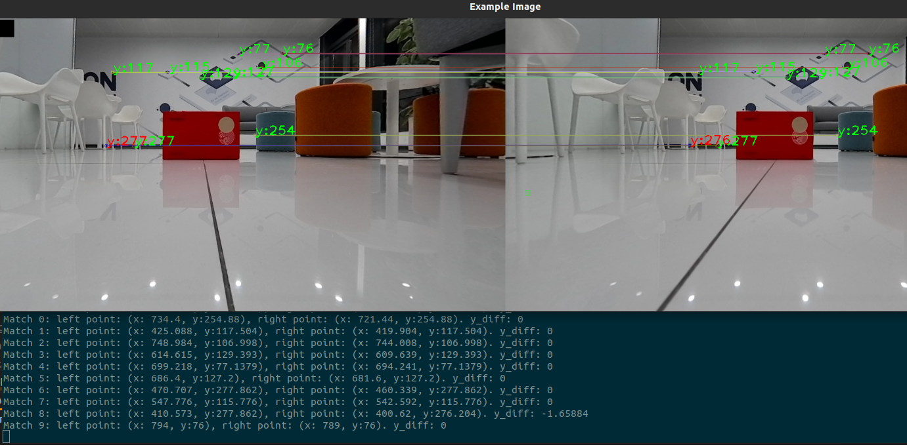

Green indicates aligned y-coordinates; red indicates misalignment. The matching results will also be saved locally in "result.jpg". Press "Enter" to read the next image and "q" to exit the tool. The console log shows the specific matching results.

### Depth Map/Disparity Map Offline Rendering Tool

- Code File Path

```
hobot_stereonet/script/render.py
```

- Running

1. Install Python dependencies

```shell
pip install -r requirements.txt
```

2. File Organization Format

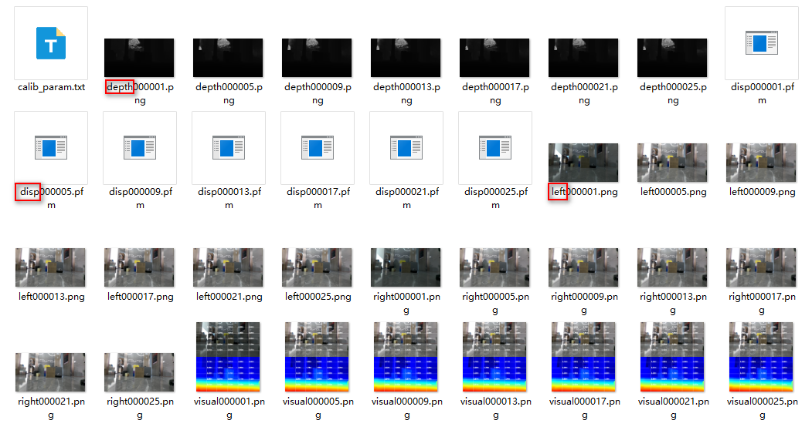

The program reads files starting with `depth`, `disp`, and `left`, corresponding to `depth map`, `disparity map`, and `left image`, respectively. The `depth map` supports `png` format `16bit` images, and the `disparity map` supports `pfm/tiff` format `float32` images. Keep the prefixes fixed and ensure the suffixes of the `depth map`, `disparity map`, and `left image` are consistent.

3. Batch Rendering

```shell
# Specify the folder path via img_dir, the rendering type (depth or disparity) via img_type, and the save path via save_dir
python render.py --img_dir=./depth_img_dir --img_type=depth --save_dir=./render_depth
```

4. Single Image Rendering

```shell
# Specify the single image path via img_path, the rendering type (depth or disparity) via img_type, and the save path via save_dir
python render.py --img_path=./depth000001.png --img_type=depth --save_dir=./render_depth
```

5. Parameter Explanations

| Parameter Name      | Default Value                                  | Type   | Description                                                                                                                                                       |
| ------------------- | ---------------------------------------------- | ------ | ----------------------------------------------------------------------------------------------------------------------------------------------------------------- |
| img_dir             | ''                                             | string | Folder directory containing required left, depth, and disparity images for rendering needs                                                                        |
| img_path            | ''                                             | string | Path to the image for rendering; specify the path to a single depth/disparity image                                                                               |
| img_type            | depth                                          | string | Type of image for rendering; can be set to [depth, disp]. Must specify whether rendering depth or disparity map                                                   |
| min_disp            | 2.0                                            | float  | Disparities smaller than this value will not be rendered and will be black                                                                                        |
| max_disp            | 192.0                                          | float  | Disparities larger than this value will not be rendered and will be black                                                                                         |
| min_depth           | 0.0                                            | float  | Depths smaller than this value will not be rendered and will be black                                                                                             |
| max_depth           | 10000.0 (default unit is mm, representing 10m) | float  | Depths larger than this value will not be rendered and will be black                                                                                              |
| save_dir            | ''                                             | string | Directory for saving results; will be created automatically                                                                                                       |
| save_gif            | False                                          | bool   | Whether to save a GIF image; setting to True will save a GIF animation in the results directory                                                                   |
| need_left_img       | False                                          | bool   | Whether to include the left image when saving results; requires corresponding left images in the folder, which will be concatenated above the depth/disparity map |
| need_speckle_filter | True                                           | bool   | Whether to apply speckle filter to remove scatter points in the depth/disparity map                                                                               |

### Result Display

| Depth Rendering Result                                | Disparity Rendering Result                          |
| ----------------------------------------------------- | --------------------------------------------------- |
| 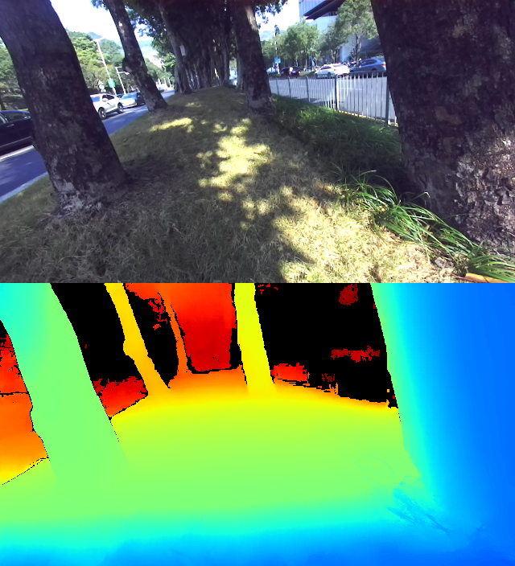 | 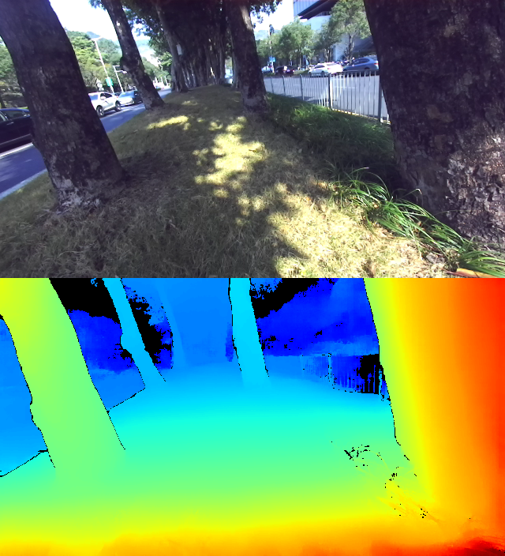 |