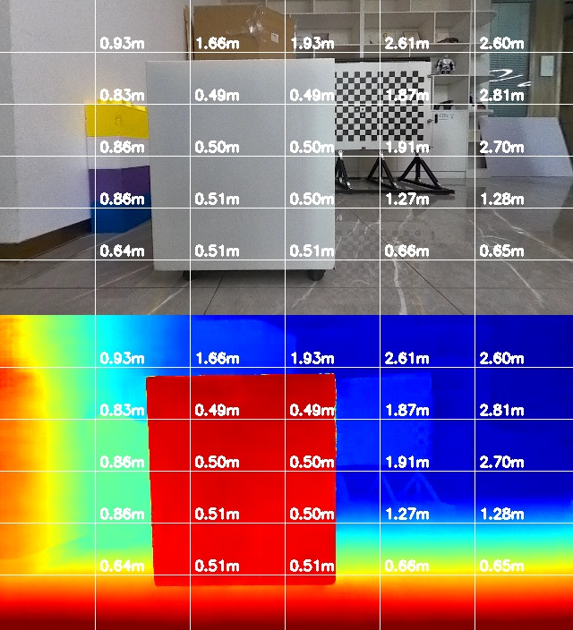
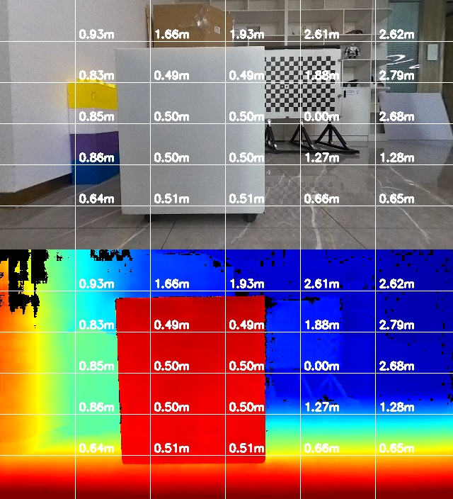
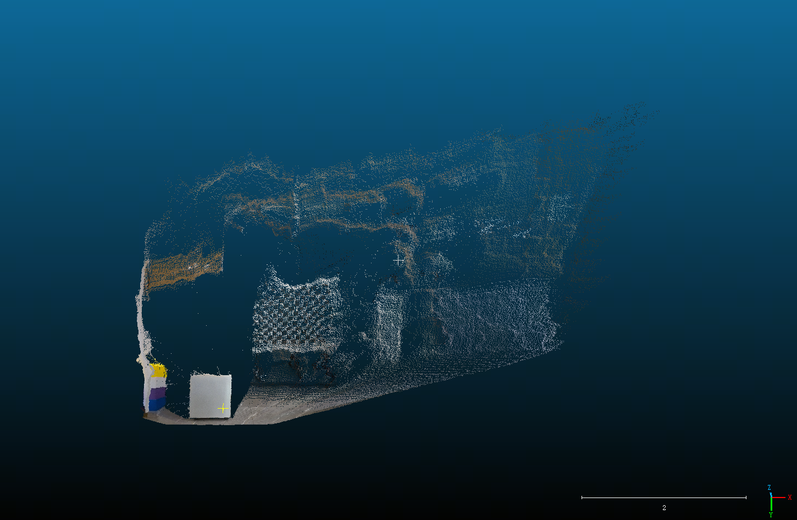

# hobot_stereonet

## Overview

**Hobot StereoNet** is a high-performance, deep learning-based stereo depth estimation algorithm developed by D-Robotics. It processes stereo image pairs to generate accurate depth maps in real-time, enabling 3D perception for robotics and computer vision applications.

## Key Features

- **Real-time Depth Estimation**: Processes stereo images at 15-25 FPS depending on model version
- **Multiple Model Versions**: Trade-off between accuracy and speed for different use cases
- **Hardware Acceleration**: Optimized for D-Robotics RDK platforms with BPU support
- **ROS2 Integration**: Seamless integration with ROS2 ecosystem

## Quick Start

- 中文文档：https://developer.d-robotics.cc/rdk_doc/Robot_development/boxs/spatial/hobot_stereonet
- English Document: https://developer.d-robotics.cc/rdk_doc/en/Robot_development/boxs/spatial/hobot_stereonet

## Project Structure

```
hobot_stereonet/
├── include/                     # Header files
│   ├── stereonet_component.h    # ROS2 component
│   ├── stereonet_process.h      # Core processing
│   ├── camera_intrinsic.h       # Camera model
│   └── ...
├── src/                         # Source files
├── launch/                      # ROS2 launch configurations
│   ├── x5/                      # RDK X5 specific launch files
│   ├── s100/                    # RDK S100 specific launch files
│   └── *.launch.py              # Generic launch files
├── config/                      # Configuration files
│   └── *.bin                    # Model files
├── script/                      # Python utilities
├── tools/                       # C++ tools
├── standalone/                  # Standalone (non-ROS) version
│   ├── 3rdparty/                # Standalone dependencies
│   ├── docs/                    # Documentation and examples
│   ├── img/                     # Sample images
│   └── main.cpp                 # Standalone main entry point
└── 3rdparty/                    # Third-party dependencies
```

| File                            | Description                 | Purpose                                                     |
| ------------------------------- | --------------------------- | ----------------------------------------------------------- |
| `stereonet_component.h/.cpp`    | ROS2 component wrapper      | Manages ROS2 lifecycle, parameters, and topic communication |
| `stereonet_process.h/.cpp`      | Core processing pipeline    | Orchestrates the stereo depth estimation workflow           |
| `camera_intrinsic.h`            | Camera model                | Handles camera calibration parameters and projections       |
| `epipolar_align.h/.cpp`         | Epipolar alignment          | Aligns stereo images for optimal depth estimation           |
| `feature_epipolar_align.h/.cpp` | Feature-based alignment     | Advanced feature matching for epipolar alignment            |
| `stereo_rectify.h/.cpp`         | Stereo rectification        | Rectifies stereo image pairs                                |
| `pcl_filter.h/.cpp`             | Point cloud filtering       | Filters and processes 3D point clouds                       |
| `speckle_filter.h/.cpp`         | Speckle filtering           | Removes noise from depth maps                               |
| `img_convert_utils.h/.cpp`      | Image conversion utilities  | Converts between different image formats                    |
| `file_utils.h/.cpp`             | File utilities              | Handles file I/O operations                                 |
| `timer_utils.h/.cpp`            | Timing utilities            | Performance measurement and profiling                       |
| `performance_record.h`          | Performance recording       | Tracks algorithm performance metrics                        |
| `log_macros.h`                  | Logging macros              | Custom logging system for debugging                         |
| `pub_data.h`                    | Data publication structures | Defines data structures for publishing results              |
| `dnn_platform.h`                | DNN platform abstraction    | Abstracts hardware-specific DNN operations                  |
| `order_blockqueue.hpp`          | Thread-safe queue           | Concurrent queue implementation for data flow               |

## Data Flow Architecture

```
┌─────────────────┐     ┌──────────────────┐    ┌─────────────────┐
│  Stereo Camera  │───▶│  Image Preproc   │───▶│  DNN Inference  │
│   (MIPI/USB)    │     │ (Rectify/Align)  │    │   (BPU/CPU)     │
└─────────────────┘     └──────────────────┘    └─────────────────┘
                                                       │
┌─────────────────┐      ┌──────────────────┐     ┌─────────────────┐
│   Visualization  │◀───│  Post-processing  │◀───│  Depth Map      │
│   (Web/RViz2)    │    │ (Filter/Convert)  │     │   Generation    │
└─────────────────┘      └──────────────────┘     └─────────────────┘
```

## Standalone Version
The [standalone](standalone) version provides a non-ROS implementation for:
- **Development and testing** without ROS dependencies
- **Performance benchmarking** in RDK platforms
- **Integration** into non-ROS applications

## Visual Results

### Visualization Images
Combined visualization showing original image and depth overlay.

| Without Uncertainty Filtering                                           | With Uncertainty Filtering                                           |
| ----------------------------------------------------------------------- | -------------------------------------------------------------------- |
|  |  |

**Visualization Features:**
- **Top**: Original left image
- **Bottom**: Depth pseudo-color overlay
- **Color Gradient**: Red → Yellow → Green → Blue (near → far)
- **Grid Points**: Show actual depth values at sample points
- **Black Holes**: Areas filtered out by uncertainty (right image)

### 3D Point Clouds
Generated 3D point clouds from depth maps.

| Without Uncertainty Filtering                                                           | With Uncertainty Filtering                                                           |
| --------------------------------------------------------------------------------------- | ------------------------------------------------------------------------------------ |
|  |  |

**Point Cloud Characteristics:**
- **Colors**: RGB values from original image
- **Density**: ~200K points depending on scene
- **Format**: PCD (Point Cloud Data) format
- **Coordinate System**: Camera coordinate system (Z = depth)

### Ouput Files

| File Name        | Format             | Description                                                       | Visualization Tool                            |
| ---------------- | ------------------ | ----------------------------------------------------------------- | --------------------------------------------- |
| `depth.png`      | PNG (16-bit)       | Depth map aligned with left image (unit: mm)                      | [cvkit](https://github.com/roboception/cvkit) |
| `disparity.pfm`  | PFM (float32)      | Disparity map aligned with left image (unit: pixels)              | [cvkit](https://github.com/roboception/cvkit) |
| `visual.png`     | PNG (8-bit RGB)    | Visualization image (top: left image, bottom: depth pseudo-color) | Any image viewer                              |
| `pointcloud.pcd` | PCD (ASCII/binary) | 3D point cloud generated from left image                          | [CloudCompare](https://www.cloudcompare.org/) |

## Support

- Documentation: [D-Robotics Developer Portal](https://developer.d-robotics.cc)
- Community: [D-Robotics Developer Forum](https://forum.d-robotics.cc/)
- Issues: [GitHub Issues](https://github.com/D-Robotics/hobot_stereonet/issues)

## License

Apache License 2.0 - See [LICENSE](LICENSE) for details.