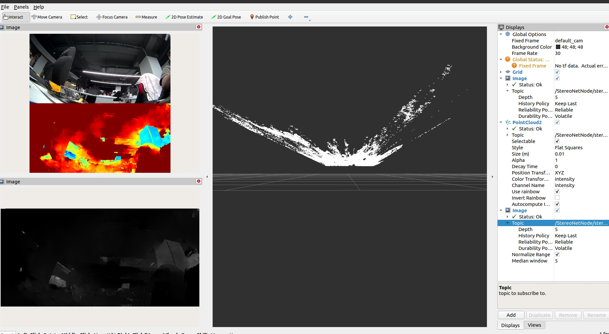
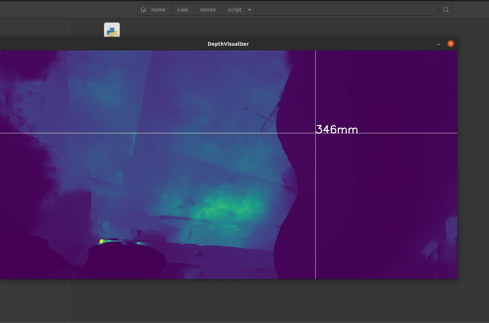

# 功能介绍

双目深度估计算法是使用地平线[OpenExplorer](https://developer.horizon.ai/api/v1/fileData/horizon_j5_open_explorer_cn_doc/hat/source/examples/stereonet.html)在[SceneFlow](https://lmb.informatik.uni-freiburg.de/resources/datasets/SceneFlowDatasets.en.html)数据集上训练出来的`StereoNet`模型。

算法输入为双目图像数据，分别是左右视图。算法输出为左视图的视差。

此示例使用mipi双目相机作为图像数据输入源，利用BPU进行算法推理，发布包含双目图像左图和感知结果的话题消息，
在PC端rviz2上渲染算法结果。

# 物料清单

双目相机

# 使用方法

## 功能安装

在RDK系统的终端中运行如下指令，即可快速安装：

tros humble 版本
```bash
sudo apt update
sudo apt install -y tros-humble-hobot-stereonet
```

## 启动双目图像发布、算法推理和图像可视化

在RDK系统的终端中运行如下指令启动：

tros humble 版本
```shell
# 配置tros.b humble环境
source /opt/tros/humble/setup.bash

# 终端1 启动双目模型launch文件
ros2 launch stereonet_model stereonet_model.launch.py \
stereo_image_topic:=/image_combine_raw stereo_combine_mode:=1 need_rectify:="True"

# 终端2 启动mipi双目相机launch文件
ros2 launch mipi_cam mipi_cam_dual_channel.launch.py \
mipi_image_width:=1280 mipi_image_height:=640
```

另外可以通过 component 的方式启动节点
```shell 
# 配置tros.b humble环境
source /opt/tros/humble/setup.bash

# 终端1 启动双目模型launch文件
ros2 launch stereonet_model stereonet_model_component.launch.py \
stereo_image_topic:=/image_combine_raw stereo_combine_mode:=1 need_rectify:="True" 

# 终端2 启动mipi双目相机launch文件
ros2 launch mipi_cam mipi_cam_dual_channel.launch.py \
mipi_image_width:=1280 mipi_image_height:=640
```

启动成功后，打开同一网络电脑的rviz2，订阅双目模型节点发布的相关话题，即可看到算法可视化的实时效果：


# 接口说明

## 订阅话题

| 名称         | 消息类型                             | 说明                                     |
| ------------ | ------------------------------------ | ---------------------------------------- |
| /image_combine_raw  | sensor_msgs::msg::Image   | 双目相机节点发布的左右目拼接图像话题，用于模型推理深度             |


## 发布话题

| 名称         | 消息类型                             | 说明                                     |
| ------------ | ------------------------------------ | ---------------------------------------- |
| /StereoNetNode/stereonet_pointcloud2  | sensor_msgs::msg::PointCloud2                | 发布的点云深度话题             |
| /StereoNetNode/stereonet_depth  | sensor_msgs::msg::Image                | 发布的深度图像，像素值为深度，单位为毫米              |
| /StereoNetNode/stereonet_visual  | sensor_msgs::msg::Image                | 发布的比较直观的可视化渲染图像             |

## 参数

| 名称                         | 参数值   | 说明     |
| --------------------------- | ------------------------ | ------------------------------ |
| stereo_image_topic        | 默认 /image_combine_raw | 订阅双目图像消息的话题名                        |
| need_rectify        | 默认 True | 是否对双目数据做基线对齐和去畸变，相机内外参在config/stereo.yaml文件内指定
| stereo_combine_mode        | 默认 1 | 左右目图像往往拼接在一张图上再发布出去，1为上下拼接，0为左右拼接，指示双目算法如何拆分图像   

# 深度测量
包内提供了script/evaluate_depth.py交互式脚本，用户可通过鼠标查看对应像素点的深度。
在PC侧直接运行脚本即可，需保证PC与X5处于同一网段和同一ROS_DOMAIN_ID。
```shell
python evaluate_depth.py
```


# 算法耗时
当log等级设置为debug时，程序会打印出算法各阶段耗时情况，供用户debug算法性能瓶颈。
```shell
ros2 launch stereonet_model stereonet_model.launch.py \
stereo_image_topic:=/image_combine_raw stereo_combine_mode:=1 need_rectify:="True" log_level:=debug
```

# 注意事项
1. 模型的输入尺寸为宽：1280，高640，相机发布的图像分辨率应为1280x640
2. 如果双目相机发布图像的格式为NV12，那么双目图像的拼接方式必须为上下拼接