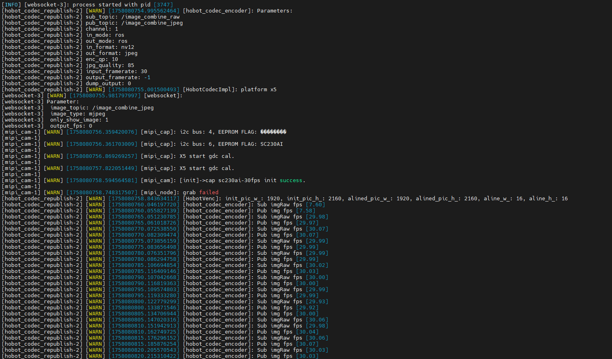
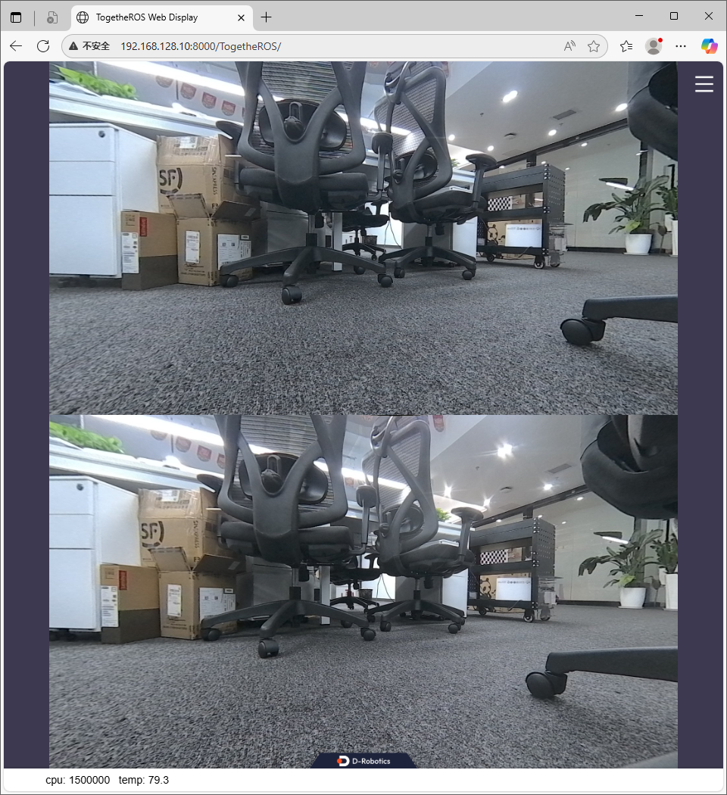
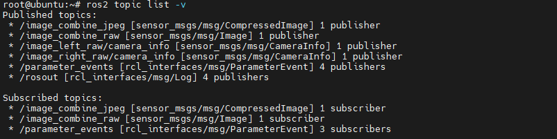
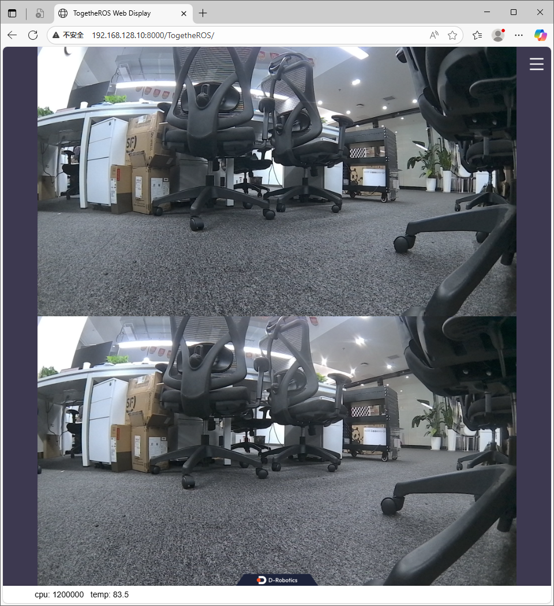
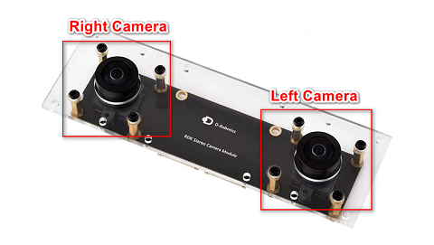
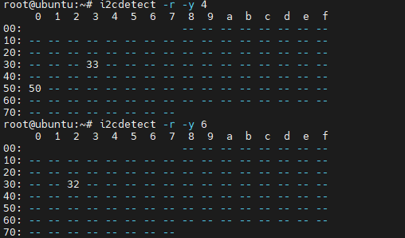
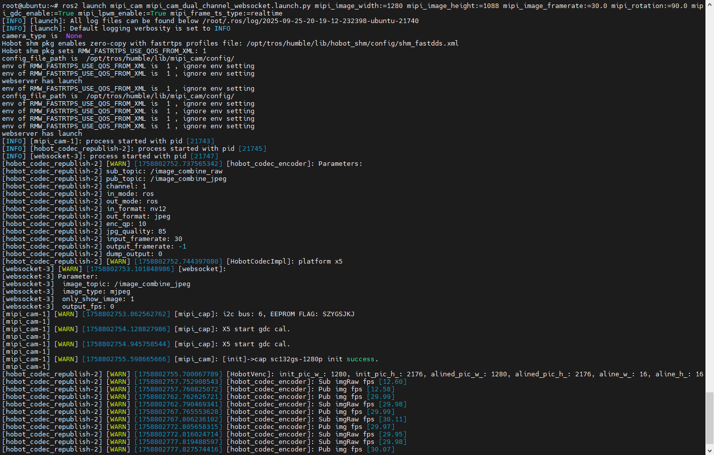
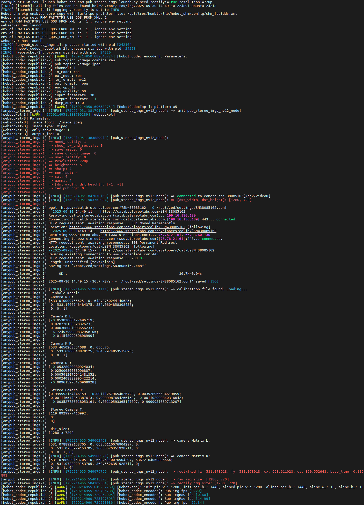

# hobot_stereonet

[English](./README.md) | 简体中文

## 功能介绍

地瓜双目深度估计算法输入为双目图像数据，输出为左视图对应的视差图和深度图。算法借鉴IGEV网络，采用了GRU架构，具有较好的数据泛化性和较高的推理效率。

## 准备工作

- 支持平台：RDK X5, RDK X5 Module / RDK S100, RDK S100P，以下文档中出现`RDK`，如果没有特殊说明，代表RDK X5和RDK S100都能执行
- 双目相机，支持230AI MIPI双目相机、132GS MIPI双目相机、ZED USB双目相机
- 如果没有双目相机，也支持离线图片回灌，需要准备好左右图像和相机参数

## 特别说明（必看）

请采用`root`用户执行文档中的命令，一般RDK还有一个`sunrise`用户，请不要使用该用户执行文档中的指令，会存在权限不足的问题

## 功能安装

### 从TROS.b安装

- 使用RDK的用户，可以直接通过apt安装TROS.b，TROS.b包含hobot_stereonet功能包，请按照对应的文档运行算法即可：[双目深度算法](https://developer.d-robotics.cc/rdk_doc/Robot_development/boxs/spatial/hobot_stereonet/)

### 从源码构建

- 建议使用交叉编译环境对源码进行编译，交叉编译环境的搭建指南：[5.1.3 源码安装](https://developer.d-robotics.cc/rdk_doc/Robot_development/quick_start/cross_compile)

- 搭建好环境后，创建ROS2工作空间，执行如下指令编译源码：

```bash
# git clone本仓库到工作空间的src目录
git clone https://github.com/D-Robotics/hobot_stereonet.git
# 在工作空间目录执行交叉编译指令
bash ./robot_dev_config/build.sh -p X5 -s hobot_stereonet
```

## 双目模型的版本

目前双目算法已有如下版本可供使用：

| 平台 | 算法版本 | 量化方式 | 输入尺寸    | 推理帧率(fps) | 算法特性                       |
| ---- | -------- | -------- | ----------- | ------------- | ------------------------------ |
| X5   | V2.0     | int16    | 640x352x3x2 | 15            | 精度较高、帧率较低             |
| X5   | V2.1     | int16    | 640x352x3x2 | 15            | 有置信度输出                   |
| X5   | V2.2     | int8     | 640x352x3x2 | 23            | 精度较低、帧率较高             |
| X5   | V2.3     | int8     | 640x352x3x2 | 27            | 帧率进一步提升                 |
| X5   | V2.4     | int16    | 640x352x3x2 | 15            | 加入更多数据训练               |
| X5   | V2.4     | int8     | 640x352x3x2 | 23            | 加入更多数据训练               |
| S100 | V2.1     | int16    | 640x352x3x2 | 53            | 有置信度输出                   |
| S100 | V2.4     | int16    | 640x352x3x2 | 53            | 有置信度输出，加入更多数据训练 |


## 功能包参数说明

| 名称                      | 默认值                                     | 说明                                                                                                   |
| ------------------------- | ------------------------------------------ | ------------------------------------------------------------------------------------------------------ |
| stereo_image_topic        | /image_combine_raw                         | 订阅的双目组合图像话题，左图和右图需要上下拼接，支持nv12、bgr8、rgb8格式                               |
| camera_info_topic         | /image_right_raw/camera_info               | 订阅的相机参数话题，需要矫正后的参数                                                                   |
| depth_image_topic         | /StereoNetNode/stereonet_depth             | 发布的深度数据话题                                                                                     |
| depth_camera_info_topic   | /StereoNetNode/stereonet_depth/camera_info | 发布的深度图对应的相机参数话题                                                                         |
| pointcloud2_topic         | /StereoNetNode/stereonet_pointcloud2       | 发布的点云数据话题                                                                                     |
| rectify_left_image_topic  | /StereoNetNode/rectify_left_image          | 发布的矫正左图话题                                                                                     |
| rectify_right_image_topic | /StereoNetNode/rectify_right_image         | 发布的矫正右图话题                                                                                     |
| publish_rectify_bgr       | False                                      | 发布矫正图像的数据格式是否采用bgr8，默认是nv12                                                         |
| origin_left_image_topic   | /StereoNetNode/origin_left_image           | 发布的原始左图数据话题，从stereo_image_topic拆分出来的左图                                             |
| origin_right_image_topic  | /StereoNetNode/origin_right_image          | 发布的原始右图数据话题，从stereo_image_topic拆分出来的右图                                             |
| visual_image_topic        | /StereoNetNode/stereonet_visual            | 发布的左图和深度图上下拼接的渲染图像话题，用于可视化                                                   |
| render_type               | indoor                                     | 渲染图像的模式，支持[indoor, outdoor]，可以在室内室外用不同的渲染模式                                  |
| render_perf               | True                                       | 渲染图像是否显示CPU、BPU占用率、Latency、FPS等信息                                                     |
| pointcloud_height_min     | -5.0                                       | 发布点云数据的最小高度，单位m                                                                          |
| pointcloud_height_max     | 5.0                                        | 发布点云数据的最大高度，单位m                                                                          |
| pointcloud_depth_max      | 5.0                                        | 发布点云数据的最大深度，单位m                                                                          |
| calib_method              | none                                       | 图像矫正的方式，支持[none, custom]，none表示不对输入图像进行矫正，custom表示提供自定义标定参数矫正图像 |
| stereo_calib_file_path    | ""                                         | 自定义相机标定参数路文件的路径，当calib_method:=custom时需要指定                                       |
| camera_fx                 | 0.0                                        | 相机矫正后的fx                                                                                         |
| camera_fy                 | 0.0                                        | 相机矫正后的fy                                                                                         |
| camera_cx                 | 0.0                                        | 相机矫正后的cx                                                                                         |
| camera_cy                 | 0.0                                        | 相机矫正后的cy                                                                                         |
| baseline                  | 0.0                                        | 相机矫正后的基线距离，单位为m                                                                          |
| uncertainty_th            | -0.10                                      | 置信度参数，当模型支持置信度输出，并且设置为正数时才生效，建议开启时设置为0.10                         |
| save_result_flag          | False                                      | 保存结果的开关，设置为True将会保存左右图、视差图、深度图、点云等数据                                   |
| save_dir                  | ./stereonet_result                         | 保存数据的目录                                                                                         |
| save_freq                 | 1                                          | 保存数据的频率                                                                                         |
| save_total                | -1                                         | 保存数据的总数，-1表示一直保存                                                                         |
| use_local_image_flag      | False                                      | 使用离线数据开关，设置为True表示使用离线数据进行推理                                                   |
| local_image_dir           | ""                                         | 回灌数据的目录                                                                                         |
| image_sleep               | 0                                          | 防止回灌数据太快，可以加入一些延迟，单位ms                                                             |
| speckle_filter_enable     | False                                      | speckle filter滤波开关，开启可滤除一些离群点                                                           |
| max_speckle_size          | 100                                        | 小于该数量的speckle将会被滤除                                                                          |
| max_disp_diff             | 1.0                                        | 视差差异小于该阈值的像素将会组成speckle                                                                |
| pcl_filter_enable         | False                                      | 点云滤波开关，开启可滤除一些离群点                                                                     |
| grid_size                 | 0.1                                        | 点云滤波时的网格大小，单位m                                                                            |
| grid_min_point_count      | 5                                          | 点云滤波时的网格最小点数，小于该数量的点会被滤除                                                       |

## 搭配双目相机在线运行双目算法

### 搭配230AI MIPI双目相机

(1) 230AI MIPI双目相机如图所示


**注意：请检查相机背面丝印印有CDPxxx-V3，确认相机是V3版本，V3版本的相机支持LPWM信号硬件同步，并且带有出厂自带参数，可以进行GDC矫正**

(2) 安装方式如图所示，接线请勿接反，会导致左右图对调，双目算法运行错误：


(3) 确认相机连接是否正常

- 在RDK X5执行以下命令，如果输出0x30/0x32/0x50地址，则代表相机i2c信号正常：

 ```bash
 i2cdetect -r -y 4
 i2cdetect -r -y 6
 ```

 

- 在RDK S100执行以下命令，如果输出0x30/0x32/0x50地址，则代表相机i2c信号正常：

 ```bash
i2cdetect -r -y 1
i2cdetect -r -y 2
 ```

 

**注意：以上指令只能确保相机i2c信号正常，并不能完全保证相机连接没有问题，也会存在i2c信号正常，但相机无法正常工作的情况。这种情况一般是mipi线没有连接稳定导致，比如mipi线松动、或者mipi线损坏，请检查一下是否有此类情况！**

(4) 启动MIPI双目相机

- 启动相机之前，要确保RDK板端安装有[hobot_mipi_cam](https://github.com/D-Robotics/hobot_mipi_cam.git)功能包，然后在RDK板端执行如下命令：

```bash
source /opt/tros/humble/setup.bash

ros2 launch mipi_cam mipi_cam_dual_channel_websocket.launch.py \
mipi_image_width:=1920 mipi_image_height:=1080 mipi_image_framerate:=30.0 \
mipi_gdc_enable:=True mipi_lpwm_enable:=True mipi_frame_ts_type:=realtime
```

- 相机启动成功会打印如下日志：



- 并且在与RDK连接的PC端（能相互ping通）浏览器上输入网址[http://rdk_ip:8000](http://rdk_ip:8000)能够查看相机采集的图像，如下图RDK的ip地址为`192.168.128.10`



- 启动参数解析：
  - `mipi_image_width:=1920 mipi_image_height:=1080`表示相机输出分辨率是1920*1080，这是230ai相机最大的输出分辨率
  - `mipi_image_framerate:=30.0`表示相机启动的帧率是30FPS
  - `mipi_gdc_enable:=True`表示相机开启GDC矫正，所以发布的图是矫正后的左右图，并且会发布相机的矫正参数
  - `mipi_lpwm_enable:=True`表示相机开启LPWM信号硬件同步，保证左右图是同一时刻曝光并且曝光时间一致（目前曝光策略是自动曝光，暂不支持调节曝光时间）
  - `mipi_frame_ts_type:=realtime`表示左右图像的时间戳是采用芯片的系统时间，如果设置为`sensor`则采用芯片的开机时间

当`mipi_gdc_enable:=True`时，`hobot_mipi_cam`功能包启动会发布两个话题`/image_combine_raw`和`/image_right_raw/camera_info`，正是`hobot_stereonet`功能包需要订阅的双目图像和相机矫正后参数




当`mipi_gdc_enable:=False`时，`hobot_mipi_cam`功能包启动只会发布`/image_combine_raw`话题，该话题是是带畸变的双目图像，如果输入`hobot_stereonet`功能包，要额外提供矫正参数



(5) 确认相机顺序

启动双目算法的之前，**一定要验证双目相机发出来的图像上图是左相机采集的图像**，双目相机对于左右相机的定义如下图所示，可以用障碍物遮挡一下左相机判断，如果不满足要求，算法启动是错误的，建议通过交换MIPI线的接线方式解决，也可以通过加入参数解决：



如果左右图顺序不对，可以在以上启动命令上加入以下参数：

RDK X5上增加:

```bash
mipi_channel:=0 mipi_channel2:=2
```

RDK S100上增加:

```bash
mipi_channel:=0 mipi_channel2:=1
```

(6) 启动双目深度算法

通过以上步骤验证230AI双目相机能正常启动后，则可以启动双目深度算法，通过ssh连接RDK，在`/root`目录或其它目录创建`run_stereo.sh`脚本：

```bash
#!/bin/bash
source /opt/tros/humble/setup.bash

ros2 pkg prefix mipi_cam
ros2 pkg prefix hobot_stereonet

stereonet_version=v2.0
calib_method=none
stereo_calib_file_path=calib.yaml
uncertainty_th=-0.10
render_type=indoor
render_perf=True
speckle_filter_enable=False
max_speckle_size=100
max_disp_diff=1.0
pcl_filter_enable=False
grid_size=0.1
grid_min_point_count=5
save_result_flag=False
save_dir=./stereonet_result
save_freq=1
save_total=-1

while [[ $# -gt 0 ]]; do
  case $1 in
    --stereonet_version) stereonet_version=$2; shift 2 ;;
    --calib_method) calib_method=$2; shift 2 ;;
    --stereo_calib_file_path) stereo_calib_file_path=$2; shift 2 ;;
    --uncertainty_th) uncertainty_th=$2; shift 2 ;;
    --render_type) render_type=$2; shift 2 ;;
    --render_perf) render_perf=$2; shift 2 ;;
    --speckle_filter_enable) speckle_filter_enable=$2; shift 2 ;;
    --max_speckle_size) max_speckle_size=$2; shift 2 ;;
    --max_disp_diff) max_disp_diff=$2; shift 2 ;;
    --pcl_filter_enable) pcl_filter_enable=$2; shift 2 ;;
    --grid_size) grid_size=$2; shift 2 ;;
    --grid_min_point_count) grid_min_point_count=$2; shift 2 ;;
    --save_result_flag) save_result_flag=$2; shift 2 ;;
    --save_dir) save_dir=$2; shift 2 ;;
    --save_freq) save_freq=$2; shift 2 ;;
    --save_total) save_total=$2; shift 2 ;;
    *) echo "unknown param: $1"; exit 1 ;;
  esac
done

ros2 launch hobot_stereonet stereonet_model_web_visual_$stereonet_version.launch.py \
mipi_image_width:=640 mipi_image_height:=352 mipi_image_framerate:=30.0 \
mipi_gdc_enable:=True mipi_lpwm_enable:=True mipi_frame_ts_type:=realtime \
calib_method:=$calib_method stereo_calib_file_path:=$stereo_calib_file_path \
uncertainty_th:=$uncertainty_th \
render_type:=$render_type render_perf:=$render_perf \
speckle_filter_enable:=$speckle_filter_enable max_speckle_size:=$max_speckle_size max_disp_diff:=$max_disp_diff \
pointcloud_height_min:=-5.0 pointcloud_height_max:=5.0 pointcloud_depth_max:=5.0 \
pcl_filter_enable:=$pcl_filter_enable grid_size:=$grid_size grid_min_point_count:=$grid_min_point_count \
save_result_flag:=$save_result_flag save_dir:=$save_dir save_freq:=$save_freq save_total:=$save_total
```

然后在RDK执行以下命令启动双目深度算法

```bash
ros run_stereo.sh --<param> <value>
```

其中可设置参数包括如下参数：

- stereonet_version控制启动不同版本的算法
  - RDK X5可以设置为`v2.0`、`v2.1`、`v2.2`、`v2.3`、`v2.4_int16`、`v2.4_int8`
  - RDK S100可以设置为`v2.1`、`v2.4`
- calib_method控制矫正方式
  - 当`mipi_gdc_enable:=True`时，代表`hobot_mipi_cam`功能包已经对图像经过矫正，`hobot_stereonet`功能包不需要再进行矫正，calib_method设置为`none`即可
  - 当`mipi_gdc_enable:=False`时，或者相机无法对图像进行矫正时，需要将calib_method设置为`custom`，并且需要指定`stereo_calib_file_path`
- stereo_calib_file_path控制自定义标定参数的路径
- uncertainty_th控制置信度，只有带置信度的模型并且设置为正数时才会生效，如果需要开启，建议设置为`0.10`
- render_type控制渲染方式，可以设置为`indoor`、`outdoor`，web可以显示渲染图像
- render_perf控制渲染图像上是否展示CPU、BPU占用率、Latency、FPS信息，可以设置为`True`、`False`
- speckle_filter_enable控制是否开启speckle filter滤波，可以设置为`True`、`False`
- max_speckle_size控制speckle的大小，小于该大小的speckle将会被滤除，设置越大，滤波效果更强
- max_disp_diff控制speckle中视差的差异阈值，邻域小于该阈值的像素点将划分为同一个speckle，设置越小，滤波效果更强
- pcl_filter_enable控制是否开启点云滤波，可以设置为`True`、`False`
- grid_size控制点云滤波时的网格大小，单位m
- grid_min_point_count控制点云滤波时的网格最小点数，小于该数量的点会被滤除
- save_result_flag控制是否保存结果，如果开启保存则会保存**相机参数、原始左右图、矫正后左右图、视差图、深度图、点云**
- save_dir控制保存的目录，目录不存在会自动创建，请确保该目录下有足够空间，否则会保存失败
- save_freq控制保存的频率，例如设置为4代表每隔4帧保存一次
- save_total控制保存的总数，设置为-1代表一直保存，设置为100代表保存100帧则不再保存

例如，在RDK X5上启动v2.4_in16版本的算法，则可执行如下指令：

```bash
ros run_stereo.sh --stereonet_version v2.4_int16
```

如果需要保存结果，则可增加参数：

```bash
ros run_stereo.sh --stereonet_version v2.4_int16 --save_result_flag True
```

(7) 查看算法输出结果

1. 通过web端查看


2. 通过rqt/rviz2查看


### 搭配132GS MIPI双目相机

(1) 132GS MIPI双目相机如图所示

(2) 安装方式如图所示，接线请勿接反，会导致左右图对调，双目算法运行错误：

(3) 确认相机连接是否正常

- 在RDK X5执行以下命令，如果输出0x32/0x33/0x50地址，则代表相机i2c信号正常：

 ```bash
 i2cdetect -r -y 4
 i2cdetect -r -y 6
 ```

 

- 在RDK S100执行以下命令，如果输出0x32/0x33/0x50地址，则代表相机i2c信号正常：

 ```bash
i2cdetect -r -y 1
i2cdetect -r -y 2
 ```

 

**注意：以上指令只能确保相机i2c信号正常，并不能完全保证相机连接没有问题，也会存在i2c信号正常，但相机无法正常工作的情况。这种情况一般是mipi线没有连接稳定导致，比如mipi线松动、或者mipi线损坏，请检查一下是否有此类情况！**

(4) 启动MIPI双目相机

- 启动相机之前，要确保RDK板端安装有[hobot_mipi_cam](https://github.com/D-Robotics/hobot_mipi_cam.git)功能包，然后在RDK板端执行如下命令：

```bash
source /opt/tros/humble/setup.bash

ros2 launch mipi_cam mipi_cam_dual_channel_websocket.launch.py \
mipi_image_width:=1280 mipi_image_height:=1088 mipi_image_framerate:=30.0 mipi_rotation:=90.0 \
mipi_gdc_enable:=True mipi_lpwm_enable:=True mipi_frame_ts_type:=realtime
```

- 相机启动成功会打印如下日志：



- 并且在与RDK连接的PC端（能相互ping通）浏览器上输入网址[http://rdk_ip:8000](http://rdk_ip:8000)能够查看相机采集的图像，如下图RDK的ip地址为`192.168.128.10`

- 启动参数解析：
  - `mipi_image_width:=1280 mipi_image_height:=1088`表示相机输出分辨率是1280*1088，这是132gs相机最大的输出分辨率
  - `mipi_image_framerate:=30.0`表示相机启动的帧率是30FPS
  - `mipi_rotation:=90.0`表示相机启动的旋转角度是顺时针旋转90度，由于132GS相机的CMOS安装人为旋转了90度，所以需要在启动时指定旋转角度
  - `mipi_gdc_enable:=True`表示相机开启GDC矫正，所以发布的图是矫正后的左右图，并且会发布相机的矫正参数
  - `mipi_lpwm_enable:=True`表示相机开启LPWM信号硬件同步，保证左右图是同一时刻曝光并且曝光时间一致（目前曝光策略是自动曝光，暂不支持调节曝光时间）
  - `mipi_frame_ts_type:=realtime`表示左右图像的时间戳是采用芯片的系统时间，如果设置为`sensor`则采用芯片的开机时间

当`mipi_gdc_enable:=True`时，`hobot_mipi_cam`功能包启动会发布两个话题`/image_combine_raw`和`/image_right_raw/camera_info`，正是`hobot_stereonet`功能包需要订阅的双目图像和相机矫正后参数


当`mipi_gdc_enable:=False`时，`hobot_mipi_cam`功能包启动只会发布`/image_combine_raw`话题，该话题是是带畸变的双目图像，如果输入`hobot_stereonet`功能包，要额外提供矫正参数


(5) 确认相机顺序

启动双目算法的之前，**一定要验证双目相机发出来的图像上图是左相机采集的图像**，双目相机对于左右相机的定义如下图所示，可以用障碍物遮挡一下左相机判断，如果不满足要求，算法启动是错误的，建议通过交换MIPI线的接线方式解决，也可以通过加入参数解决：


如果左右图顺序不对，可以在以上启动命令上加入以下参数：

RDK X5上增加:

```bash
mipi_channel:=0 mipi_channel2:=2
```

RDK S100上增加:

```bash
mipi_channel:=1 mipi_channel2:=0
```

(6) 启动双目深度算法

通过以上步骤验证132GS双目相机能正常启动后，则可以启动双目深度算法，通过ssh连接RDK，在`/root`目录或其它目录创建`run_stereo.sh`脚本：

```bash
#!/bin/bash
source /opt/tros/humble/setup.bash

ros2 pkg prefix mipi_cam
ros2 pkg prefix hobot_stereonet

rm -rf performance_*.txt

stereonet_version=v2.0
calib_method=none
stereo_calib_file_path=calib.yaml
uncertainty_th=-0.10
render_type=indoor
render_perf=True
speckle_filter_enable=False
max_speckle_size=100
max_disp_diff=1.0
pcl_filter_enable=False
grid_size=0.1
grid_min_point_count=5
save_result_flag=False
save_dir=./stereonet_result
save_freq=1
save_total=-1

while [[ $# -gt 0 ]]; do
  case $1 in
    --stereonet_version) stereonet_version=$2; shift 2 ;;
    --calib_method) calib_method=$2; shift 2 ;;
    --stereo_calib_file_path) stereo_calib_file_path=$2; shift 2 ;;
    --uncertainty_th) uncertainty_th=$2; shift 2 ;;
    --render_type) render_type=$2; shift 2 ;;
    --render_perf) render_perf=$2; shift 2 ;;
    --speckle_filter_enable) speckle_filter_enable=$2; shift 2 ;;
    --max_speckle_size) max_speckle_size=$2; shift 2 ;;
    --max_disp_diff) max_disp_diff=$2; shift 2 ;;
    --pcl_filter_enable) pcl_filter_enable=$2; shift 2 ;;
    --grid_size) grid_size=$2; shift 2 ;;
    --grid_min_point_count) grid_min_point_count=$2; shift 2 ;;
    --save_result_flag) save_result_flag=$2; shift 2 ;;
    --save_dir) save_dir=$2; shift 2 ;;
    --save_freq) save_freq=$2; shift 2 ;;
    --save_total) save_total=$2; shift 2 ;;
    *) echo "unknown param: $1"; exit 1 ;;
  esac
done

ros2 launch hobot_stereonet stereonet_model_web_visual_$stereonet_version.launch.py \
mipi_image_width:=640 mipi_image_height:=352 mipi_image_framerate:=30.0 mipi_rotation:=90.0 \
mipi_gdc_enable:=True mipi_lpwm_enable:=True mipi_frame_ts_type:=realtime \
calib_method:=$calib_method stereo_calib_file_path:=$stereo_calib_file_path \
uncertainty_th:=$uncertainty_th \
render_type:=$render_type render_perf:=$render_perf \
speckle_filter_enable:=$speckle_filter_enable max_speckle_size:=$max_speckle_size max_disp_diff:=$max_disp_diff \
pointcloud_height_min:=-5.0 pointcloud_height_max:=5.0 pointcloud_depth_max:=5.0 \
pcl_filter_enable:=$pcl_filter_enable grid_size:=$grid_size grid_min_point_count:=$grid_min_point_count \
save_result_flag:=$save_result_flag save_dir:=$save_dir save_freq:=$save_freq save_total:=$save_total
```

然后在RDK执行以下命令启动双目深度算法

```bash
ros run_stereo.sh --<param> <value>
```

其中可设置参数包括如下参数：

- stereonet_version控制启动不同版本的算法
  - RDK X5可以设置为`v2.0`、`v2.1`、`v2.2`、`v2.3`、`v2.4_int16`、`v2.4_int8`
  - RDK S100可以设置为`v2.1`、`v2.4`
- calib_method控制矫正方式
  - 当`mipi_gdc_enable:=True`时，代表`hobot_mipi_cam`功能包已经对图像经过矫正，`hobot_stereonet`功能包不需要再进行矫正，calib_method设置为`none`即可
  - 当`mipi_gdc_enable:=False`时，或者相机无法对图像进行矫正时，需要将calib_method设置为`custom`，并且需要指定`stereo_calib_file_path`
- stereo_calib_file_path控制自定义标定参数的路径
- uncertainty_th控制置信度，只有带置信度的模型并且设置为正数时才会生效，如果需要开启，建议设置为`0.10`
- render_type控制渲染方式，可以设置为`indoor`、`outdoor`，web可以显示渲染图像
- render_perf控制渲染图像上是否展示CPU、BPU占用率、Latency、FPS信息，可以设置为`True`、`False`
- speckle_filter_enable控制是否开启speckle filter滤波，可以设置为`True`、`False`
- max_speckle_size控制speckle的大小，小于该大小的speckle将会被滤除，设置越大，滤波效果更强
- max_disp_diff控制speckle中视差的差异阈值，邻域小于该阈值的像素点将划分为同一个speckle，设置越小，滤波效果更强
- pcl_filter_enable控制是否开启点云滤波，可以设置为`True`、`False`
- grid_size控制点云滤波时的网格大小，单位m
- grid_min_point_count控制点云滤波时的网格最小点数，小于该数量的点会被滤除
- save_result_flag控制是否保存结果，如果开启保存则会保存**相机参数、原始左右图、矫正后左右图、视差图、深度图、点云**
- save_dir控制保存的目录，目录不存在会自动创建，请确保该目录下有足够空间，否则会保存失败
- save_freq控制保存的频率，例如设置为4代表每隔4帧保存一次
- save_total控制保存的总数，设置为-1代表一直保存，设置为100代表保存100帧则不再保存

例如，在RDK X5上启动v2.4_in16版本的算法，则可执行如下指令：

```bash
ros run_stereo.sh --stereonet_version v2.4_int16
```

如果需要保存结果，则可增加参数：

```bash
ros run_stereo.sh --stereonet_version v2.4_int16 --save_result_flag True
```

### 搭配ZED USB双目相机

(1) ZED双目摄像头如图所示：


(2) 将ZED相机通过USB连接RDK，即可启动ZED相机

- 启动相机之前，要确保RDK板端安装有[hobot_zed_cam](https://github.com/D-Robotics/hobot_zed_cam.git)功能包，然后在RDK板端执行如下命令：

```bash
source /opt/tros/humble/setup.bash

ros2 launch hobot_zed_cam pub_stereo_imgs.launch.py \
need_rectify:=True resolution:=720p dst_width:=1280 dst_height:=720
```

- 相机启动成功会打印如下日志：



**注意：need_rectify:=True的情况下，第一次启动ZED相机，ZED相机会去官方服务器下载每台相机对应的标定参数，所以要确保RDK联网，如果没有联网，则会报错。相机的标定参数会保存在`/root/zed/settings/`目录下的SNXXX.conf（XXX为相机的序列号）文件中。如果标定文件下载失败，需要手动下载标定文件后，上传到RDK的`/root/zed/settings/`目录下。如果启动日志报错提示`serial_num error`，说明相机的序列号读取失败，可以重新插拔一下USB接口再尝试执行上述命令。**

- 手动下载标定文件

如果RDK无法联网下载标定文件，也可以根据日志提示在PC上通过浏览器下载标定文件，然后上传到RDK的`/root/zed/settings/`目录下，具体操作如下：

1. 找到日志中的`wget 'https://calib.stereolabs.com/?SN=38085162' -O /root/zed/settings/SN38085162.conf`这一行，其中`38085162`为相机序列号
2. 在PC上打开浏览器，输入`https://calib.stereolabs.com/?SN=38085162`，即可下载标定文件，文件名称为`SN38085162.conf`，下载完成后，将文件上传到RDK的`/root/zed/settings/`目录下即可，如果目录不存在，手动创建一个即可
3. 一定要确保读出正确的序列号，如果序列号为`-1`等特殊的情况，可以重新插拔USB接口再尝试执行上述命令

- 启动参数解析：
  - `need_rectify:=True`表示图像需要矫正，如果不需要矫正，可以设置为`need_rectify:=False`
  - `resolution:=720p`表示ZED相机输出分辨率是720p，还可以设置为`resolution:=1080p`
  - `dst_width:=1280 dst_height:=720`表示最终输出图像的宽高，如果不设置，则会使用ZED相机的输出分辨率，此参数的设置主要是为了适配双目算法模型，因为模型的输入图像分辨率是640x352，而ZED相机的输出分辨率是1280x720，所以需要设置成这个值


(3) 启动双目深度算法

通过以上步骤验证ZED相机能正常启动后，则可以启动双目深度算法，通过ssh连接RDK，在`/root`目录或其它目录创建`run_stereo.sh`脚本：

```bash
#!/bin/bash
source /opt/tros/humble/setup.bash

ros2 pkg prefix hobot_zed_cam
ros2 pkg prefix hobot_stereonet

rm -rf performance_*.txt

stereonet_version=v2.0
calib_method=none
stereo_calib_file_path=calib.yaml
uncertainty_th=-0.10
render_type=indoor
render_perf=True
speckle_filter_enable=False
max_speckle_size=100
max_disp_diff=1.0
pcl_filter_enable=False
grid_size=0.1
grid_min_point_count=5
save_result_flag=False
save_dir=./stereonet_result
save_freq=1
save_total=-1

while [[ $# -gt 0 ]]; do
  case $1 in
    --stereonet_version) stereonet_version=$2; shift 2 ;;
    --calib_method) calib_method=$2; shift 2 ;;
    --stereo_calib_file_path) stereo_calib_file_path=$2; shift 2 ;;
    --uncertainty_th) uncertainty_th=$2; shift 2 ;;
    --render_type) render_type=$2; shift 2 ;;
    --render_perf) render_perf=$2; shift 2 ;;
    --speckle_filter_enable) speckle_filter_enable=$2; shift 2 ;;
    --max_speckle_size) max_speckle_size=$2; shift 2 ;;
    --max_disp_diff) max_disp_diff=$2; shift 2 ;;
    --pcl_filter_enable) pcl_filter_enable=$2; shift 2 ;;
    --grid_size) grid_size=$2; shift 2 ;;
    --grid_min_point_count) grid_min_point_count=$2; shift 2 ;;
    --save_result_flag) save_result_flag=$2; shift 2 ;;
    --save_dir) save_dir=$2; shift 2 ;;
    --save_freq) save_freq=$2; shift 2 ;;
    --save_total) save_total=$2; shift 2 ;;
    *) echo "unknown param: $1"; exit 1 ;;
  esac
done

ros2 launch hobot_stereonet stereonet_model_web_visual_zed_$stereonet_version.launch.py \
need_rectify:=True resolution:=720p dst_width:=640 dst_height:=352 \
calib_method:=$calib_method stereo_calib_file_path:=$stereo_calib_file_path \
uncertainty_th:=$uncertainty_th \
render_type:=$render_type render_perf:=$render_perf \
speckle_filter_enable:=$speckle_filter_enable max_speckle_size:=$max_speckle_size max_disp_diff:=$max_disp_diff \
pointcloud_height_min:=-5.0 pointcloud_height_max:=5.0 pointcloud_depth_max:=5.0 \
pcl_filter_enable:=$pcl_filter_enable grid_size:=$grid_size grid_min_point_count:=$grid_min_point_count \
save_result_flag:=$save_result_flag save_dir:=$save_dir save_freq:=$save_freq save_total:=$save_total
```

然后在RDK执行以下命令启动双目深度算法

```bash
ros run_stereo.sh --<param> <value>
```

其中可设置参数包括如下参数：

- stereonet_version控制启动不同版本的算法
  - RDK X5可以设置为`v2.0`、`v2.2`
  - RDK S100可以设置为`v2.1`、`v2.4`
- calib_method控制矫正方式
  - 当`mipi_gdc_enable:=True`时，代表`hobot_mipi_cam`功能包已经对图像经过矫正，`hobot_stereonet`功能包不需要再进行矫正，calib_method设置为`none`即可
  - 当`mipi_gdc_enable:=False`时，或者相机无法对图像进行矫正时，需要将calib_method设置为`custom`，并且需要指定`stereo_calib_file_path`
- stereo_calib_file_path控制自定义标定参数的路径
- uncertainty_th控制置信度，只有带置信度的模型并且设置为正数时才会生效，如果需要开启，建议设置为`0.10`
- render_type控制渲染方式，可以设置为`indoor`、`outdoor`，web可以显示渲染图像
- render_perf控制渲染图像上是否展示CPU、BPU占用率、Latency、FPS信息，可以设置为`True`、`False`
- speckle_filter_enable控制是否开启speckle filter滤波，可以设置为`True`、`False`
- max_speckle_size控制speckle的大小，小于该大小的speckle将会被滤除，设置越大，滤波效果更强
- max_disp_diff控制speckle中视差的差异阈值，邻域小于该阈值的像素点将划分为同一个speckle，设置越小，滤波效果更强
- pcl_filter_enable控制是否开启点云滤波，可以设置为`True`、`False`
- grid_size控制点云滤波时的网格大小，单位m
- grid_min_point_count控制点云滤波时的网格最小点数，小于该数量的点会被滤除
- save_result_flag控制是否保存结果，如果开启保存则会保存**相机参数、原始左右图、矫正后左右图、视差图、深度图、点云**
- save_dir控制保存的目录，目录不存在会自动创建，请确保该目录下有足够空间，否则会保存失败
- save_freq控制保存的频率，例如设置为4代表每隔4帧保存一次
- save_total控制保存的总数，设置为-1代表一直保存，设置为100代表保存100帧则不再保存


### 使用离线图像回灌算法

如果想利用离线图片评估算法效果，需要准备如下文件：
- 如果双目图像已经经过畸变矫正，实现极线对齐，那么需要准备好左右图像和相机矫正后的参数，左右图像保存在同一个文件夹下，格式为png或者jpg，左图名称需要包含`left`字样，右图名称需要包含`right`字样，名称其它部分保持一致，例如left000000.png、right000000.png则代表一对图像。矫正后相机参数可以以文件形式保存在图像文件夹下，也可以手动传入参数，如果以文件形式保存，命名为`camera_intrinsic.txt`，文件格式如下，注意baseline单位为m：

  ```bash
  # fx fy cx cy baseline(m)
  259.251129 259.251129 326.866028 176.007141 0.119893
  ```

- 如果双目图像未经过畸变矫正，那么需要准备好左右图像和相机的标定文件，左右图像的要求同上。目前功能包支持opencv的pinhole和fisheye模型进行矫正，需要将标定参数保存为yaml文件，例如文件名为`stereo.yaml`，内容如下：

  - opencv pinhole模型
  ```bash
  %YAML:1.0
  stereo0:
    cam0:
      cam_overlaps: [1]
      camera_model: pinhole
      distortion_coeffs: [13.629939992216803, 8.262704454746693, 0.00013591208815828305, 5.855947395629785e-05, 0.4037751346185162, 13.977836003424704, 13.013009617644387, 2.071424233931501]
      distortion_model: rational_polynomial
      intrinsics: [658.2324304920313, 658.372667603159, 645.7728450571832, 548.0568683145651]
      resolution: [1280, 1088]
      rostopic: /cam0/image_raw
    cam1:
      T_cn_cnm1:
        - [0.9999948259397319, 0.0030710970579646184, 0.000957317411288589, -0.07994701973026999]
        - [-0.003065052737874916, 0.9999757549474934, -0.0062525969728369196, 8.62919426379695e-05]
        - [-0.000976496533245612, 0.006249630393170863, 0.9999799940871164, -3.827807106513583e-05]
        - [0.0, 0.0, 0.0, 1.0]
      cam_overlaps: [0]
      camera_model: pinhole
      distortion_coeffs: [1.271973336215351, 0.5033929275481956, 3.869896485509561e-05, -5.4665668099983295e-05, 0.026396763086218075, 1.624708798309856, 0.8619327950330554, 0.12733144355384968]
      distortion_model: rational_polynomial
      intrinsics: [659.1838534998161, 659.1731444444313, 641.4400240177297, 546.151522982614]
      resolution: [1280, 1088]
      rostopic: /cam1/image_raw
  ```

  - opencv fisheye模型
  ```bash
  %YAML:1.0
  stereo0:
    cam0:
      cam_overlaps: [1]
      camera_model: pinhole
      distortion_coeffs: [-0.019945602743413032, -0.006407219074809645, 0.010377644042076124, -0.007458612934618145]
      distortion_model: equidistant
      intrinsics: [658.1741247046973, 658.3060171249508, 646.0535363898956, 548.5366637704661]
      resolution: [1280, 1088]
      rostopic: /cam0/image_raw
    cam1:
      T_cn_cnm1:
        - [0.9999944641310871, 0.0030224403875748498, 0.001391603852978104, -0.0796251330890793]
        - [-0.003014189986257964, 0.9999780927190145, -0.005893109600935581, 0.00018203189483717266]
        - [-0.0014093849391877738, 0.00588888241905485, 0.9999816671809277, 7.477455846886338e-05]
        - [0.0, 0.0, 0.0, 1.0]
      cam_overlaps: [0]
      camera_model: pinhole
      distortion_coeffs: [-0.019364498751516145, -0.003005220334441206, 0.003170178343620349, -0.003583574629938659]
      distortion_model: equidistant
      intrinsics: [659.0941516375445, 659.1203053601091, 641.1785231268192, 546.3196124732525]
      resolution: [1280, 1088]
      rostopic: /cam1/image_raw
      fov_scale: 0.73
  ```


## 离线工具

### 检查极线对齐精度

极线不对齐会极大影响算法精度。源码目录下的tools文件夹内提供了极线对齐检测工具，可以在PC上检查相机图像的极线对齐精度。工具使用特征提取和匹配算法检查极线是否完全对齐，理想情况下，特征点的y坐标应该完全一致。选取10个最佳的匹配点，检查匹配点的y坐标。


PC上需要预装ROS2以及OpenCV (version: 4)

```shell
# 在PC上进入tools目录，创建build目录并编译
cd tools
mkdir build
cd build
cmake ..
make -j2
# 运行工具，image_path是需要检查的图像的地址
./stereonet_matcher --ros-args -p image_path:=`pwd`/../images/
```

工具运行后会显示出对齐的结果，选取10个特征点对比其在左右目的y坐标，如下图。


绿色表示y坐标对齐，红色表示没有对齐。匹配的结果同时会保存在本地的"result.jpg"。工具敲入“回车”键读取下一张图，敲入“q”键退出工具。控制台打印的log是具体的匹配结果。

### 深度图/视差图离线渲染工具

- 代码文件路径

```
hobot_stereonet/script/render.py
```

- 运行

1. 安装python依赖包

```shell
pip install -r requirements.txt
```

2. 文件组织格式


程序会读取`depth`、`disp`、`left`开头的文件，对应`深度图`、`视差图`、`左图`，其中`深度图`支持`png`格式的`16bit`
图像，`视差图`支持`pfm/tiff`格式的`float32`图像，请固定文件的开头，并保证`深度图`、`视差图`、`左图`的后缀是一致的。

3. 批量渲染

```shell
# 通过img_dir指定文件夹路径，img_type指定渲染深度图还是视差图，save_dir指定保存路径
python render.py --img_dir=./depth_img_dir --img_type=depth --save_dir=./render_depth
```

4. 单张图渲染

```shell
# 通过img_path指定但张图路径，img_type指定渲染深度图还是视差图，save_dir指定保存路径
python render.py --img_path=./depth000001.png --img_type=depth --save_dir=./render_depth
```

5. 参数说明

| 名称                | 默认值                              | 类型   | 说明                                                                              |
| ------------------- | ----------------------------------- | ------ | --------------------------------------------------------------------------------- |
| img_dir             | ''                                  | string | 文件夹目录，按渲染需求包含需要的左图、深度图、视差图                              |
| img_path            | ''                                  | string | 渲染图像的路径，指定单张深度图/视差图的路径                                       |
| img_type            | depth                               | string | 渲染图像的类型，可设置为[depth, disp]，一定要指定渲染的是深度图还是视差图         |
| min_disp            | 2.0                                 | float  | 视差小于该值，不进行渲染，颜色为黑色                                              |
| max_disp            | 192.0                               | float  | 视差大于该值，不进行渲染，颜色为黑色                                              |
| min_depth           | 0.0                                 | float  | 深度小于该值，不进行渲染，颜色为黑色                                              |
| max_depth           | 10000.0 (默认单位是mm，这里表示10m) | float  | 深度大于该值，不进行渲染，颜色为黑色                                              |
| save_dir            | ''                                  | string | 保存结果的目录，会自动创建                                                        |
| save_gif            | False                               | bool   | 是否保存gif图像，设置会True会在结果目录保存gif动图                                |
| need_left_img       | False                               | bool   | 是否在保存结果时附带左图，需要对应的文件夹下有左图，左图会拼接在深度图/视差图上方 |
| need_speckle_filter | True                                | bool   | 是否需要speckle filter，会去除深度图/视差图的散点                                 |

### 结果展示

| 深度渲染结果                                          | 视差渲染结果                                        |
| ----------------------------------------------------- | --------------------------------------------------- |
|  |  |

