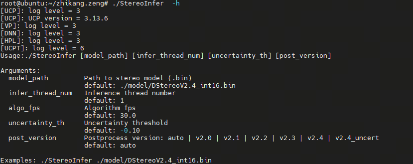
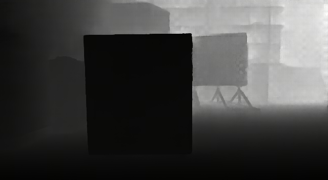
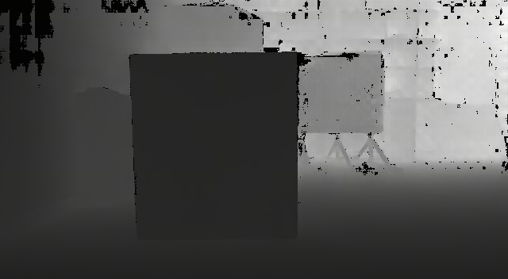
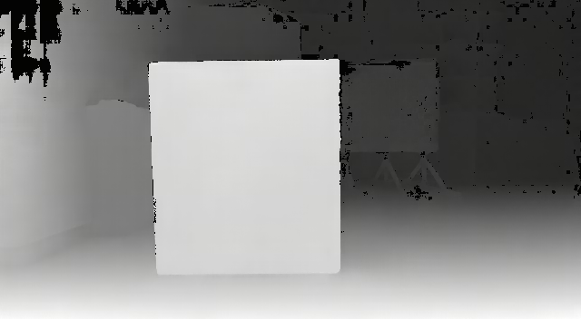

# StereoInfer

Stereo inference code. It takes stereo left-right images and camera intrinsics as input,
and outputs disparity maps, depth maps, visualization images, point clouds, etc.

## Build

-   Dependencies: OpenCV (image processing), Eigen (matrix operations),
    DNN (X5 BPU interface), NEON (ARM instruction acceleration).
    All of these libraries are located in the `3rdparty` directory.

-   Download the compiler

    -   Download link:
        https://developer.arm.com/downloads/-/arm-gnu-toolchain-downloads

    -   This example uses `arm-gnu-toolchain-11.3.rel1-x86_64-aarch64-none-linux-gnu.tar.xz `.
        Please download the corresponding version and extract it.

        ``` bash
        tar -xvf arm-gnu-toolchain-11.3.rel1-x86_64-aarch64-none-linux-gnu.tar.xz -C /opt
        ```

-   Use cross-compilation for building. Make sure the compiler path in `run_build_X5.sh` matches your own installation.

``` cmake
cmake -DCMAKE_BUILD_TYPE=Release .. \
  -DCMAKE_C_COMPILER=/opt/arm-gnu-toolchain-11.3.rel1-x86_64-aarch64-none-linux-gnu/bin/aarch64-none-linux-gnu-gcc \
  -DCMAKE_CXX_COMPILER=/opt/arm-gnu-toolchain-11.3.rel1-x86_64-aarch64-none-linux-gnu/bin/aarch64-none-linux-gnu-g++
```

-   Enter the `standalone` directory and run the build script:

``` bash
cd standalone
bash run_build_X5.sh
```

- After compilation, a test package `StereoInfer_X5.tar.gz` will be generated in the `build` directory.
The package includes two executables:

| Program   | Description                       |
| --------- | --------------------------------- |
| test_perf | Used for performance benchmarking |
| infer     | Used for offline inference        |

- Copy the test package to the userdata directory on the target board and extract it:

``` bash
cd /userdata/
tar -zxvf StereoInfer_X5.tar.gz
```

## Run

-   After extracting the test package, go into the `StereoInfer`
    directory and run the script to create symbolic links:

``` bash
cd /userdata/StereoInfer
bash make_ln.sh
```

### 1. Run performance test

``` bash
export LD_LIBRARY_PATH=${LD_LIBRARY_PATH}:/userdata/StereoInfer/3rdparty/lib_opencv4.5.4/lib/
./StereoInfer ./model/DStereoV2.4_int16_uncertainty.bin 1 30 0.10
```

Parameter Explanation:



After execution, you can check the console log output for the program's `fps`, `latency`, `cpu_usage`, `bpu_usage`.
This information is also recorded in `performance_xx.txt` in the current directory.


 | Name      | Description                                                                                                                                                  |
 | --------- | ------------------------------------------------------------------------------------------------------------------------------------------------------------ |
 | fps       | Frame processed per second                                                                                                                                   |
 | latency   | Including process of 'model inference', 'disparity porcess and convert disparity to depth and point cloud', 'uncertainty filter'                             |
 | cpu_usage | One-core CPU usage for the whole program, including model processing and result saving                                                                       |
 | bpu_usage | One-core BPU usage for the whole system. If other models, such as segmentation or detection, are running at the same time, their usage will also be included |


We have two types of models currently: one includes uncertainty information, while the other does not.
Comparing the results below, we can see that the noise can be filtered out using the uncertainty.

The following files will be generated in the `result` directory:

  | Name                       | without uncertainty Result                                     | with uncertainty Result                                                                                         | Description                                                                                                                                                            |
  | -------------------------- | -------------------------------------------------------------- | --------------------------------------------------------------------------------------------------------------- | ---------------------------------------------------------------------------------------------------------------------------------------------------------------------- |
  | depth_{timestamp}.png      |                   |                                                                    | Depth map aligned with the left image (unit: mm)                                                                                                                       |
  | disparity_{timestamp}.pfm  |                |                                                                 | Disparity map aligned with the left image (unit:pixels)                                                                                                                |
  | visual_{timestamp}.png     |    no black empty hole |    the black empty hole is the bad or edge area filtered by uncertainty | Top: left image; Bottom: depth pseudo-color image. <br> Color gradient red → yellow → green → blue indicates distance from near to far. Numbers show grid point depths |
  | pointcloud_{timestamp}.pcd |                |                                                                 | 3D point cloud generated from the left image                                                                                                                           |

### 2. Run inference

``` bash
export LD_LIBRARY_PATH=${LD_LIBRARY_PATH}:/userdata/StereoInfer/3rdparty/lib_opencv4.5.4/lib/
./infer ./model/DStereoV2.4_int16_uncertainty.bin ./img 0.10
``` 

#### Input directory format

The `infer` program supports **multi-subdirectory batch inference**.

```text
img/
 ├── scene1/
 │    ├── left_xxx.png
 │    ├── right_xxx.png
 │    ├── camera_intrinsic.txt  (or K.txt)
 │
 ├── scene2/
 │    ├── left_xxx.png
 │    ├── right_xxx.png
 │    ├── camera_intrinsic.txt  (or K.txt)
 │
 └── scene3/
      ├── ...
```

Notes:

* Each subdirectory represents one scene
* Must contain:

  * stereo image pairs
  * camera intrinsic file:

    * `camera_intrinsic.txt` **or**
    * `K.txt`
* The program will automatically search and match stereo pairs


#### Output directory

Results are saved in:

```text
result/
 ├── scene1/
 ├── scene2/
 └── scene3/
```

Each subdirectory corresponds to one input scene.

Output files

The following files will be generated in each result subdirectory:

| Name                 | Description                                           |
| -------------------- | ----------------------------------------------------- |
| depth_xxx.png        | Depth map (unit: mm), aligned with left image         |
| disp_xxx.pfm         | Disparity map (unit: pixels)                          |
| uncert_xxx.pfm       | Uncertainty map (if model supports uncertainty)       |
| visual_xxx.jpg       | Visualization image (depth pseudo-color + left image) |
| pointcloud_xxx.pcd   | Colored 3D point cloud                                |
| camera_intrinsic.txt | Resized camera intrinsic (fx fy cx cy baseline)       |
| K.txt                | Resized intrinsic matrix format                       |

## Visualization Tools

-   Disparity maps, depth maps, and visualization images: It is
    recommended to use
    [cvkit](https://github.com/roboception/cvkit/releases/tag/v2.6.10)
    to open `.pfm` and `.png` files.
-   Point cloud files: It is recommended to use
    [CloudCompare](https://www.cloudcompare.org/) to open `.pcd` files.

