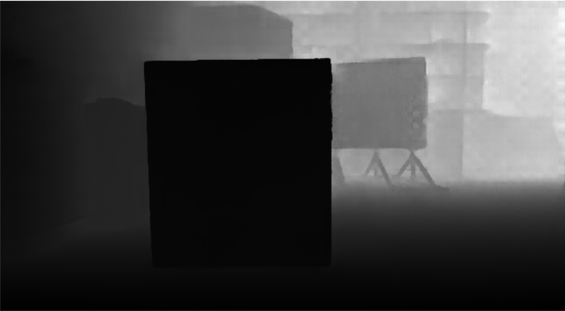
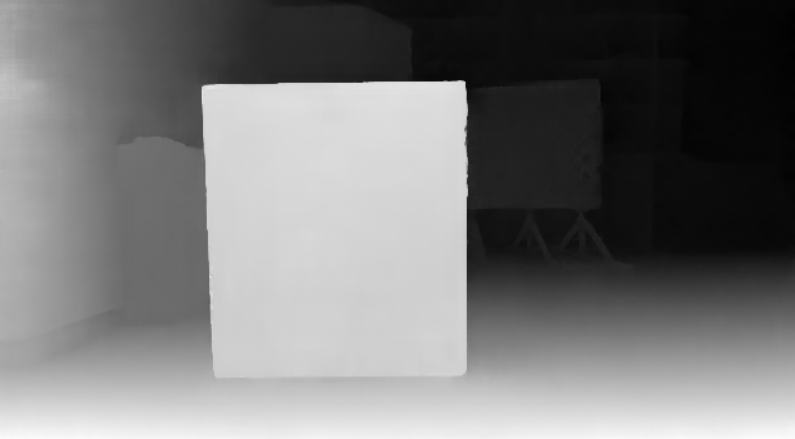
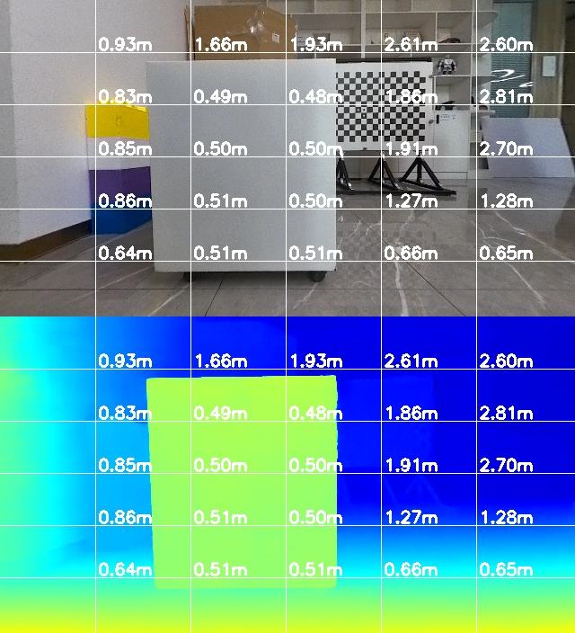
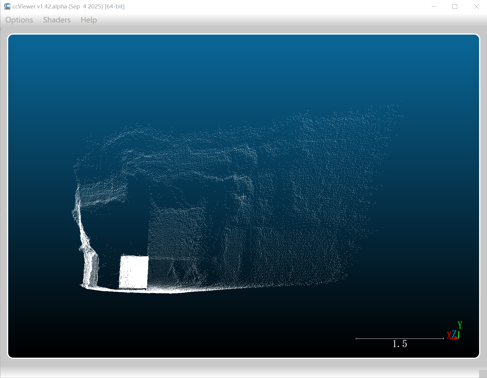

# StereoInfer

双目推理代码，输入双目左右图片和相机内参，输出视差图、深度图、渲染图、点云等

## 编译

- 依赖opencv（图像处理）、eigen（矩阵运算）、dnn（X5 BPU接口）、neon（ARM指令加速），这些库都在3rdparty目录下

- 下载编译器
  - 下载地址：https://developer.arm.com/downloads/-/arm-gnu-toolchain-downloads
  - 本例使用的是`arm-gnu-toolchain-11.3.rel1-x86_64-aarch64-none-linux-gnu.tar.xz `，请下载对应版本并解压
    ```bash
    tar -xvf arm-gnu-toolchain-11.3.rel1-x86_64-aarch64-none-linux-gnu.tar.xz
    ```

- 使用交叉编译进行编译，注意` CMakeLists.txt`的编译器目录设置为自己对应的目录

```cmake
set(CMAKE_C_COMPILER /opt/arm-gnu-toolchain-11.3.rel1-x86_64-aarch64-none-linux-gnu/bin/aarch64-none-linux-gnu-gcc)
set(CMAKE_CXX_COMPILER /opt/arm-gnu-toolchain-11.3.rel1-x86_64-aarch64-none-linux-gnu/bin/aarch64-none-linux-gnu-g++)
```

- 进入` standalone`目录并执行编译命令

```bash
cd standalone
bash run_build.sh
```

- 编译完成后会在 ` build`目录下生成算法测试包 ` StereoInfer.tar`，把测试包拷贝到`X5 `板端的`userdata `目录下并解压，解压命令：
```bash
cd /userdata/
mkdir StereoInfer
tar -xvf StereoInfer.tar -C StereoInfer
```

## 执行

- 测试包解压完成后进入` StereoInfer`目录，先执行构建软连接命令：

```
cd /userdata/StereoInfer
bash make_ln.sh
```

- 最后运行程序

```bash
export LD_LIBRARY_PATH=${LD_LIBRARY_PATH}:/userdata/StereoInfer/3rdparty/lib_opencv4.5.4/lib/
./StereoInfer
```
程序执行完毕后会在` result`目录下生成下列文件：

| 名称 | 图片 | 说明 |
|----------|------|------|
| {timestamp}_depth.png   |  | 与左目逐像素对应的深度图，单位为mm |
| {timestamp}_disparity.pfm  |  | 与左目逐像素对应的视差图，单位为pixel |
| {timestamp}_visual.jpg  |  | 上图是左目，下图是深度伪彩色图，<br>颜色由红->黄->绿->蓝渐变，表示距离由近到远。图数字表示网格点的深度 |
| {timestamp}.pcd  |  | 基于左目的三维点云 |


- 视差图、深度图、渲染图打开方式：建议安装[cvkit](https://github.com/roboception/cvkit/releases/tag/v2.6.10)软件打开` pfm`和` png`格式图像
- 点云文件打开方式：建议安装[CloudCompare](https://www.cloudcompare.org/)软件打开点云文件
